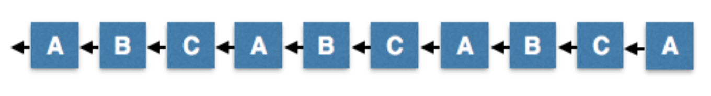
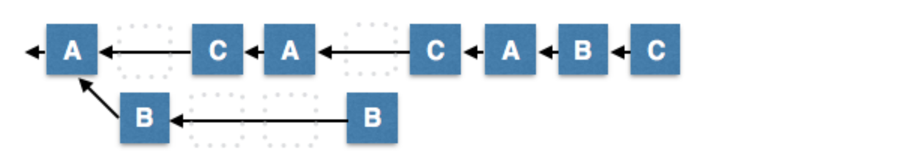
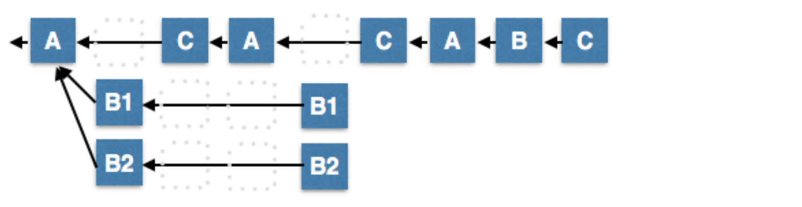
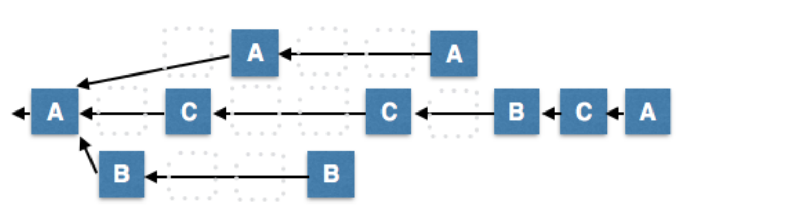
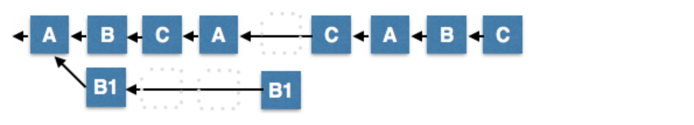
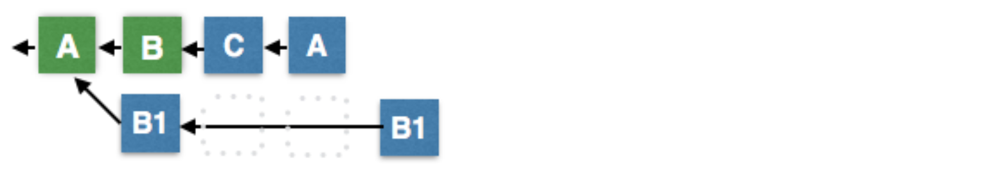
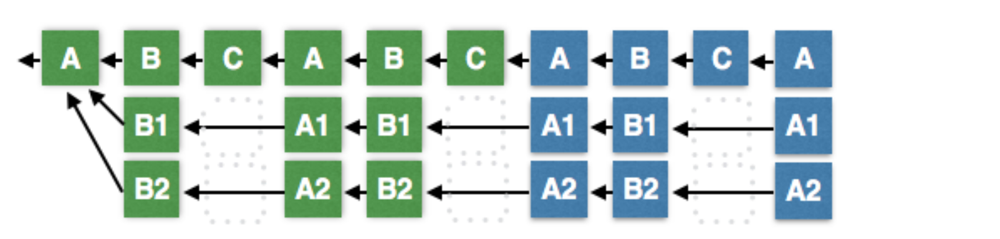

# DPOS 합의 알고리즘 – 누락된 백서 
이 문서는 누락된 백서이며 위임 지분 증명(DPOS)에 대한 분석입니다. 이 문서의 목적은 DPOS가 작동하는 이유와 무엇이 DPOS를 견고하게 만드는지 분석한 내용을 제공하는 것입니다. [DPOS에 대한 초기 설명은 bitshares.org에서 찾을 수 있습니다.](https://bitshares.org/technology/delegated-proof-of-stake-consensus/) 그러나 그 설명에는 실제 합의 과정의 일부가 아닌 많은 측면들이 포함되어 있습니다.

모든 블록체인은 근본적으로 트랜잭션에 의해 작동하는 결정론적 스테이트 머신(deterministic state machine)입니다. 합의는 트랜잭션의 결정론적 순서에 동의하고 잘못된 거래를 필터링하는 과정입니다. 동일한 트랜잭션 순서를 생성할 수 있는 여러 가지 합의 알고리즘이 있지만, DPOS는 여러 블럭체인을 수년간 안정적으로 운영해왔다는 사실로 견고하고 안전하며 효율적이라고 입증되었습니다.

모든 합의 알고리즘과 마찬가지로, 블록 프로듀서가 초래할 수 있는 가장 큰 해악은 검열입니다. 모든 블록은 결정론적 오픈소스 스테이트 머신 로직에 따라 유효해야 합니다.

## DPOS 알고리즘 요약
DPOS 알고리즘은 블록 프로듀서 그룹 선출과 블록 생성 일정을 수립하는 두 부분으로 나뉩니다. 선출 과정은 지분참여자(stakeholders)가 궁극적으로 통제권을 가질 수 있게 만듭니다. 왜냐하면 네트워크가 부드럽게 운영되지 못하면, 지분참여자는 많은 것을 잃게되기 때문입니다. 사람들이 선출되는 방식은 분 단위로 합의가 이루어지는 방법에 거의 영향을 미치지 않습니다. 따라서 이 문서는 블록 프로듀서가 선출된 후 합의가 이루어지는 방법에 초점을 맞출 것입니다.

이 알고리즘을 설명하기 위해 A, B, C라는 3명의 블록 프로듀서가 있다고 가정합니다. 모든 경우를 해결하기 위해 합의가 2/3 + 1이 필요하기 때문에, 이 단순화된 모델은 생산자 C가 타이 브레이커(tie breaker)로 간주됩니다. 현실 세계에는 21개 이상의 블록 프로듀서가 있을 것입니다. 작업 증명(Proof of Work)처럼, 가장 긴 체인이 승리한다는 것이 일반적인 규칙입니다. 정직한 피어가 유효하고 엄격하게 긴 체인을 볼 때마다 현재 포크에서 더 긴 체인으로 전환할 것입니다.

가장 상상할 수 있음직한 네트워크 상황에서 DPOS가 어떻게 동작하는지를 예제를 통해 보여드리겠습니다. 이 예제를 통해 DPOS가 견고하고 깨지기 어려운 이유를 이해하는 데 도움이 될 것입니다.

## 정상 작동
정상적인 작동 상태에서 블록 프로듀서는 3초마다 블록을 생성합니다. 아무도 자신의 차례를 놓치지 않는다고 가정하면 가장 긴 사슬이 만들어질 것입니다. 블록 프로듀서가 예정된 시간 슬롯이 아닌 다른 시간 슬롯에서 블록을 생성한다면 이는 유효하지 않습니다.

## 소수 포크
노드 중 최대 1/3이 악의적이거나 오작동할 수 있으며, 이로 인해 소수 포크를 만들 수 있습니다. 이 경우 소수 포크는 매 9초마다 한 블록만을 생성하고, 다수의 포크는 매 9초마다 두 블록을 생성할 것입니다. 다시 한번, 정직한 2/3를 구성하는 다수는 항상 소수 체인보다 길 것입니다.

## 단절된 소수의 블록 이중 생성
소수은 포크를 무제한으로 만들려고 시도할 수 있지만, 이들의 포크는 모두 대다수 체인보다 짧을 것입니다. 소수의 체인은 다수의 체인보다 느리게 커지기 때문입니다.

## 네트워크 파편화
네트워크가 파편화될 가능성이 전적으로 존재합니다. 이 경우 어떤 포크에도 블록 프로듀서의 다수가 포함되지 못합니다. 이 경우 가장 긴 체인은 가장 큰 소수의 몫이 됩니다. 네트워크 연결이 복원되면, 더 작은 수로 구성된 소수 포크는 자연적으로 가장 긴 체인으로 전환되고, 모호하지 않은 합의가 복원됩니다.

두 개의 가장 긴 포크가 길이가 같을 경우, 포크가 3개일 수 있습니다. 이 경우 3번째 프로듀서(작은 포크)는 네트워크에 다시 연결될 때 타이(tie)를 이룬 상태를 깹니다. 홀수의 프로듀서가 있기 때문에, 타이 상태를 오랫동안 유지하기가 불가능합니다. 나중에 우리는 프로듀서 생산 순서 셔플링을 설명할 것인데, 이 방법은 생산 순서를 랜덤하게 만들어서 두 개의 포크가 동일한 수의 생산자를 가지고 있더라도 각각의 포크가 다른 길이로 확 성장하게 만들어서 포크 하나가 다른 포크보다 커지도록 만듭니다.

## 연결된 소수의 이중 생산
이 시나리오에서, 소수 집단 B는 자신의 생산 시간대에 두 개 이상의 대체 블록을 생성했습니다. 다음 예정 프로듀서 (C)는 B가 생산한 대체 블록 중 하나를 선택해서 생산을 시작할 수 있습니다. 이렇게 되면 이 체인이 가장 긴 체인이 되고 B1을 선택한 모든 노드가 포크를 전환합니다. 악의를 가진 프로듀서들의 소수 집단 얼마나 많은 대체 블록을 전파하려고 시도하는 지는 중요하지 않습니다. 아무리 해도 라운드 하나 이상으로 가장 긴 체인의 일부가 절대로 될 수 없기 때문입니다.

## 마지막 비가역 블록 (Last Irreversible Block)
네트워크 파편화가 발생할 경우 여러 포크가 오랜 시간 동안 계속해서 성장할 수 있습니다. 장기적으로 가장 긴 사슬이 이길 것이지만, 관찰자는 블록이 가장 빠르게 성장하는 체인의 확실한 일부인지 확실하게 알 수 있는 수단이 필요합니다. 이것은 블록 프로듀서의 2/3 + 1에 의한 확인을 보고 결정할 수 있습니다.

아래 그림에서 블록 B는 2/3 + 1 확인을 나타내는 C와 A에 의해 확인되었고, 그렇기 때문에 생산자의 2/3이 정직한 경우 다른 어떤 체인도 더욱 길어질 가능성이 없다고 추론할 수 있습니다.

이 "규칙"은 Bitcoin의 6블록 확인 "규칙"과 유사합니다. 일부 스마트한 개인들은 두 개의 노드가 각각 다른 마지막 비가역 블록으로 끝날 수 있는 사건 발생 순서를 생각해낼 수 있습니다. 이 엣지 케이스(edge case)는 공격자가 통신 지연 상황을 완전히 통제할 수 있고 이와 같은 통제를 한 번이 아닌 두 번을 분 간격으로 통제할 수 있어야 합니다. 이런 상황이 일어날 경우, 가장 긴 사슬의 장기적인 규칙(옮긴이 주: 장기적으로 정직하게 만든 가장 긴 사슬이 살아남는다)이 여전히 적용됩니다. 우리는 그러한 공격의 확률이 0에 가까울 것으로 예상하고 경제적 결과가 아주 사소해서 걱정할 가치가 없다고 추정합니다.

## 프로듀서 정족수 부족
정족수를 채우지 못한 프로듀서 집단이 있는 예상 밖의 상황이라면, 소수 집단이 계속해서 블록을 생산하는 상황이 가능합니다. 이런 상황에서 생성된 블록에서 지분참여자들은 자신의 투표를 변경하는 트랜잭션을 보낼 수 있습니다. 이와 같은 투표는 블록을 만들 새로운 프로듀서군을 선출할 수 있고 블록 생산 참여율을 100%로 복원할 수 있습니다. 이런 일이 발생하면 소수의 체인은 결국 100% 미만의 참여율로 운영되는 다른 모든 체인을 추월하게 됩니다.

이 과정에서 모든 관찰자는 67%의 참여율을 가진 체인이 나타날 때까지 네트워크 상태가 유동적이라는 것을 알게 됩니다. 이러한 조건 하에서 트랜잭션을 보내는 액션을 선택하는 사람들은 6가지 미만의 확인을 받아들이는 사람들과 비슷한 위험을 감수합니다. 그들은 합의에 의해 궁극적으로 다른 포크에 정착할 수 있는 작은 확률이 있다는 인지한 상태로 행동하는 것입니다. 실제로 이 상황은 Bitcoin 확인이 3개 미만인 블록을 허용하는 것보다 훨씬 안전합니다.

## 프로듀서 다수의 부패
대다수의 생산자가 부패하면 무제한의 포크를 생산할 수 있으며 각 포크는 2/3의 다수결로 생산되는 것처럼 보일 것입니다. 이 경우 마지막 비가역 블록 알고리즘은 가장 긴 체인 알고리즘으로 되돌아갑니다. 가장 긴 체인은, 남은 정직한 노드의 소수에 의해 결정될 최대 다수에 의해 승인된 체인이 될 것입니다. 이러한 형태의 양상은 오래 가지 않을 것입니다. 왜냐하면 지분참여자들이 이런 프로듀서들을 교체하기 위해 결국 투표를 할 것이기 때문입니다.

## 지분 증명으로서의 트랜잭션 (TaPoS)
사용자가 트랜잭션에 서명할 때, 블록체인의 상태에 대한 특정 가정 하에서 트랜잭션에 서명합니다. 이 가정은 최근 생성된 블록들에 대한 인식에 기반합니다. 가장 긴 체인에 대한 합의가 바뀌면, 서명자가 트랜잭션에 동의했을 때 서명자가 가졌던 가정을 잠재적으로 무효화할 수 있습니다.

TaPoS를 사용하면 모든 트랜잭션에 최근 블록의 해시가 포함되며 해당 블록이 체인 기록에 존재하지 않으면 유효하지 않은 것으로 간주됩니다. 분리된 포크에서 트랜잭션에 서명하는 사용자는, 해당 트랜잭션이 유효하지 않게 되고 메인 포크로 전환할 수 없음을 알게될 것입니다.

이 프로세스의 부수적인 효과(side effect)는 대체 체인을 생성하려는 장기 공격에 대한 보안입니다. 개별 지분참여자는 트랜잭션을 만들 때마다 블록체인을 직접 확인합니다. 시간이 지남에 따라 모든 블록은 모든 지분참여자에 의해 확인되며 이것은 위조한 체인에서 복제할 수 없는 중요한 특징입니다.

## 결정론적 프로듀서 순서 셔플링
모든 예에서 우리는 블록 프로듀서의 라운드-로빈(round-robin) 스케쥴링을 보여주었습니다. 실제로 블록 프로듀서 집합은 N블록마다 셔플되고, 여기서의 N은 프로듀서의 수입니다. 이 무작위화는 블록 프로듀서 B가 블록 프로듀서 A를 항상 무시하지 않으며, 동일한 프로듀서 수를 가지는 여러 포크가 있을 때마다 동수 상황(tie)이 결국 깨질 것을 보장합니다.

## 결론
위임 지분 증명은 생각할 수 있는 모든 자연적 네트워크 혼란 상황에 견고하고 큰 소수를 구성하는 프로듀서의 부패가 발생해도 안전합니다. 일부 경쟁 알고리즘과 달리, DPOS는 프로듀서 다수가 서비스를 못하는(fail) 상황에서도 계속 작동할 수 있습니다. 이 과정에서 커뮤니티는 100% 참여율로 재개될 때까지 서비스 불능 프로듀서들을 교체하기 위해서 투표할 수 있습니다. 저는 이러한 어렵고 다양한 실패 조건 하에서도 튼튼한 다른 합의 알고리즘을 알고있지 않습니다.

궁극적으로 DPOS는 블록 프로듀서를 선출하기 위해 선택된 알고리즘으로부터 중요한 보안성을 획득하고, 프로듀서들의 노드가 높은 품질인지 개별적인 주체인지 검증합니다. 승인 투표 프로세스를 사용하면 50%의 실질적인 의결권을 행사하는 사람도 단신으로 하나의 프로듀서를 선택할 수 없습니다. DPOS는 견고한 네트워크 연결로 연동된 정직한 노드의 100% 참여라는 명목 조건의 성능을 최적화하도록 설계되었습니다. 이런 방법으로 DPOS는 평균 1.5 초 이내에 99.9%의 확실성으로 트랜잭션을 확인할 수 있는 능력을 부여받는 한편, 성능이 저하되는 상황이 오더라도 복구가 용이한 우아하고 탐지 가능한 방식으로 성능이 저하됩니다.

다른 컨센서스 알고리즘은 네트워크 상태가 좋지 않은 상황과 부정직한 노드가 있다는 명목 조건 기반으로 디자인되어 있습니다. 대안적인 설계들의 최종 결과는, 느린 성능, 높은 지연시간(latency), 높은 통신 오버헤드를 보이고 33%의 노드가 망가지는 경우 완전히 중단되는 네트워크입니다.

BitShares 3년 동안 Steem 1년 동안의 성공적인 운영을 통해서 우리는 모든 형태의 네트워크 상황과 소프트웨어 버그를 경험했습니다. DPOS는 이와 같은 환경을 성공적으로 탐색해왔고, 다른 블록체인보다 더 많은 트랜잭션을 처리하면서 컨센서스를 유지하는 능력을 입증했습니다.

## 번역 정보

* 원문 : https://steemit.com/dpos/@dantheman/dpos-consensus-algorithm-this-missing-white-paper
* 원문 최초 포스팅 시점 : 한국표준시 2017년 5월 29일