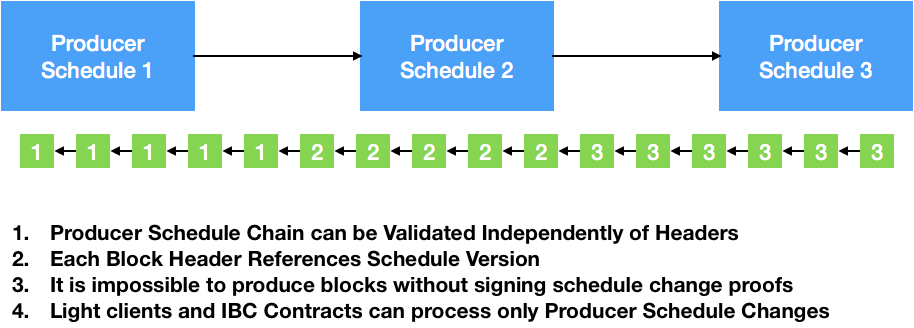
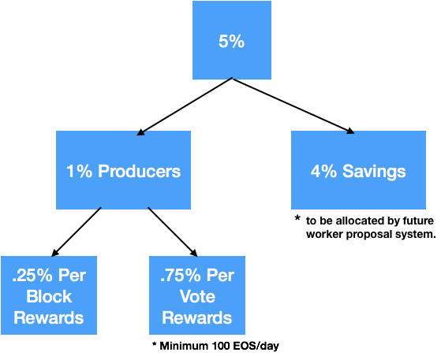

# EOSIO Dawn 4.0을 소개합니다.

블록원이 EOSIO Dawn 3.0을 출시한지 1개월 정도 지났습니다. 지난 달 우리 팀은
EOSIO 소프트웨어을 정리하고 안정화하는 데 초점을 맞춰왔습니다. 이 작업의
큰 부분은 블록체인간 통신의 개념 증명(Proof of concept)을 만드는 데 있었습니다.

merge를 제외하면, 개발자 43명은 깃헙에 커밋 818개를 푸시해왔습니다. 이로써 
EOSIO는 지난달 깃헙의 C++ 프로젝트 중 가장 활발한 8개 프로젝트 안에 들었습니다.
보시다시피 많은 일이 일어나고 있습니다.

1. `now()`는 이제 현재 시각을 돌려줍니다.
2.  시장 기반의 새로운 RAM 할당 모델
3.  블록체인간 통신의 등장
4.  DPOS 마지막 비가역 블록 알고리즘 업그레이드
5.  계정 이름 알박기
6.  헤더만 검증
7.  경량 프로듀서 스케줄 변경 증명
8.  검토된 프로듀서 보상 모델
9.  프로듀서 투표수 감소
10. 거래소 통합 지원

## `now()`는 이제 현재 시각을 돌려줍니다.

EOSIO Dawn 4.0의 가장 큰 변화 중 하나는 현재 시각의 정의를 "헤드(head) 블록의
시각"에서 "현재(current) 블록의 시각"으로 변경한 데 있습니다.
이렇게 변경한 덕분에 누락 블록이 존재하는 상황에서
시간과 관련된 작업이 정상작동할 때도 있었고 오류가 발생하기도 했던 코너
케이스를 해결하고 스마트 컨트랙트 내에서 소요 시간을 훨씬 정확하게
측정할 수 있게 되었습니다.

(옮긴이 주: 헤드 블록(head block)은 가장 최근에 만들어진 블록입니다. 헤드 블록은
마지막 비가역(변경불가확정) 블록(Last Irreversible Block, LIB)보다 블록 높이가
큽니다. 하지만 헤드 블록은 블록 프로듀서가 만들고 있는
블록(current block)보다 블록 높이가 작습니다. 변경에 대한 자세한 내용은 다음 커밋 메시지를
참조하세요. https://github.com/EOSIO/eos/commit/5a72a4b7c37c430a479ecefe4c43811b1bfab08e ) 

## 램 할당 모델

테스트 과정에서 우리는 EOSIO 시스템 컨트랙트가 토큰으로 지분참여(stake)한 
사용자들에게 RAM (데이터베이스 공간)을 할당하는 방법으로는 장래에 부족을
초래할 것이라는 사실을 알아냈습니다. Bancor 알고리즘을 이용한 시장 기반의 
할당 방식으로 전환했습니다.

계산을 해보니 이렇습니다. 1TB의 RAM이 토큰 홀더에게 토큰량 비례로 할당되면
바이트당 비용은 0.018 달러입니다(토큰당 20달러라고 가정합니다).
실제로 대부분의 토큰 홀더는 할당받을 RAM을 적극적으로 사용할 필요가
사실 없습니다. 그래서, 우리는 초기 RAM 비용을 바이트당 0.000018 달러로
정했습니다(토큰당 20달러라고 가정합니다). 새로운 계정은 대략 4KB의 RAM이
필요하고 대략 0.10 달러의 비용이 듭니다. RAM이 예약되는 양에 따라 시스템의 RAM이
부족해지기 전에 가격이 무한대에 근접하도록 가격이 자동으로 증가합니다.

Dawn 3.0 시스템 컨트랙트는 RAM을 구입한 금액에 따라서만 RAM을 팔 수 있었습니다.
그렇게 한 목적은 사재기와 투기를 억제하기 위해서였습니다. 이런 접근의 단점은
RAM 사용 수요가 많아져서 정체될 때 과거에 RAM을 싸게 구입했던 사람들이
다른 사용자를 위해 RAM에 대한 자신의 지분참여량을 줄이는(free) 재정적인 
동기가 없다는 점입니다. Dawn 4.0의 시스템 컨트랙트는 이제 현행 시장 가격으로
RAM 할당량을 매입하고 판매합니다. 이런 접근으로 미래의 잠재적인 부족을 예상하여
트레이더들이 RAM을 오늘 구입하는 결과를 만들지도 모릅니다. 전반적으로 시장은
시간이 지남에 따라 RAM에 대한 수요와 공급의 균형을 맞출 것입니다.

시간이 지남에 따라 무어의 법칙은 블록 프로듀서들이 RAM을 4TB나 심지어 16TB로
업그레이드하게 할 것이고, 이런 RAM 공급량의 증가는 EOSIO RAM 시장에 흘러들어와서
가격을 낮출 것입니다.

## 스마트 컨트랙트 개발자에게 주는 영향

스마트 컨트랙트 개발자의 입장에서는 RAM은 데이터베이스 레코드를 저장하면
소모되는 귀한 자원입니다. RAM의 비용을 고려하면, in-memory
데이터베이스에 저장하는 데이터의 양을 최소화하고 사용자가
어플리케이션 사용을 마친 후에 RAM을 비울 수 있도록 어플리케이션을 설계하는
것이 중요합니다. 예를 들어 Steem은 1주일 분량의 컨텐츠만 RAM에 저장하기 때문에
시간이 지나도 RAM의 전체 크기가 크게 늘어나지 않습니다.

## 투기 최소화

이제 RAM 시장이 생겼기 때문에, 투기꾼들은 이익을 위해 RAM 가격 변동성을
거래하려고 할 수 있습니다. EOSIO 시스템 컨트랙트는 RAM을 양도할 수 없게 만들고
거래에 대해 1%의 수수료를 부과합니다. 이와 같은 수수료로 토큰을 시장에서 꺼내어
토큰의 자연적인 가격 상승률을 상쇄하는 효과를 보일 것입니다. RAM의 연간
거래량이 연간 토큰 공급량과 같으면 블록 생산자에게 주어지는 모든 보상의 100%가
RAM 시장 수수료로 충당될 것입니다.

## 블록체인간 통신의 등장

고성능 블록체인은 모든 데이터를 RAM에 저장할 필요가 있습니다. 디스크 접근에
소요되는 시간으로 인해 트랜잭션 처리량을 겨우 초당 수백 건으로 금새 떨어뜨리기
때문입니다. RAM 사용량을 확장시키기 위해 별개의 하드웨어에서 동작하는 
별도의 메모리 리전(region)으로 구성되는 다수의 체인이 필요합니다.

EOSIO 블록 프로듀서는 RAM을 구입하고 지분참여로 대역폭을 확보하는 데 사용하는
동일한 토큰을 이용하는 서로 다른 많은 체인을 운영할 수 있습니다. 프로듀서
선출은 메인 체인에서 일어날 것이며 관련된 모든 사이드체인은 동일한 프로듀서군에
의해서 운영될 것입니다. 각 체인은 각각 1TB 이상의 RAM을 가질 수 있고 DAPP은
몇 초의 지연시간 안에서 체인 사이의 메시지를 전송할 수 있습니다.

RAM의 가격은 체인별로 다를 수 있고, 각 체인은 DAPP 개발자에게 어느 체인이
가장 저렴한지 알려줄 것입니다.

## 병렬 처리 로드맵

블록체인간 통신(Inter Blockchain Communication, 줄여서 IBC)은 크기가 1KB
이상이고 수십 개의 암호화 해시 함수 및/또는 15개 이상의 서명 검증을 포함하는
머클(merkle) 증명의 유효성을 검사하는 두 개의 체인 사이에서 일어납니다.
즉, 다른 체인의 메시지를 확인하는 데 드는 비용은 보통의 트랜잭션을 확인하는
비용보다 약 15배에서 30배 정도 높습니다.

다행히 이러한 증명을 검증하는 작업은 블록체인 상태에 의존하지 않으므로
병렬화하는 것이 쉽습니다. 다른 체인의 메시지만 처리한 블록체인은
초당 몇 천 개의 트랜잭션만 유지하면서 쉽게 30개의 CPU 코어를 점유할 수도
있을 것입니다.

블록체인간 통신을 통한 확장은 거의 무한한 확장 가능성을 제공할 것이라고
우리는 믿고 있습니다. 이 접근을 통해서 동시에 RAM, 네트워크 및 CPU 처리
용량까지 확장합니다. 서명 검증, 컨텍스트-프리 액션 검증 및 IBC 증명이
이미 단일-쓰레드 처리량이 높은 대부분의 CPU를 포화 상태로 만들 것이라는
점을 감안할 때, 멀티-쓰레드 WASM 실행 최적화는 다른 자원의 제약으로 인해
병목 현상을 일으킬 수 있습니다.

EOSIO Dawn 3.0은 미래에 멀티-쓰레드 WASM 실행을 구현할 가능성을 염두에
두고 많은 디자인 결정을 내린 결과물입니다. 불행하게도, 실제로 완전한
멀티-쓰레드 구현체를 완성하기 전까지는 정상작동할 때도 있고 오류를 발생시킬
때도 있는 코너 케이스 모두를 고쳤는지 확인하기가 불가능합니다. 즉,
EOSIO Dawn 3.0에는 당장의 이점을 주지 않는 아키텍처의 복잡성이 많았습니다.

이제 우리는 단일-쓰레드 실행에서 멀티-쓰레드 실행으로 업그레이드하는 과정이
동일한 블록 프로듀서가 멀티-쓰레드를 지원하고 동일한 네이티브 토큰으로 
지분참여할 수 있는 새로운 체인을 런칭하는 작업이라고 믿습니다. 이와 같은 과정을
통해서 라이브 체인에 대해 덮어쓰기(in-place) 업그레이드를 진행하는 위험을
감수하지 않고 새로운 체인을 이용해서 멀티-쓰레드 기능 지원에 필요한 설계 수정을
반영할 수 있는 완전한 자유를 얻게 됩니다.

이와 같은 병렬 처리 로드맵으로 우리는 EOSIO 1.0을 단순화하고 단일-쓰레드 최대
성능과 개발 편의성을 최적화할 수 있습니다. 우리는 EOSIO 단일-쓰레드 버전이
언젠가 5,000-10,000 TPS에 도달할 것이라고 예상합니다. 또한 다중-체인 방식이
전체 비용을 낮추고 빨리 확장할 수 있기 때문에 많은 어플리케이션이 다중-체인
방식을 선호할 것이라고 예상합니다.

## DPOS 마지막-비가역-블록 알고리즘 업그레이드

합의 알고리즘 논쟁을 지켜본 사람들은 아마 (Steem과 BitShares에 구현된) 마지막
비가역 블록 (last irreversible block, LIB) 알고리즘을 사용하는 DPOS가 특정한
극단적 네트워크 연결 끊김이 발생하는 상황에서 합의가 깨질 가능성이 있다는
의견을 들었을 것입니다. 과거에 저는 이와 같은 상황이 순전히 이론적인 성격을
가지고 있고 상대적으로 최소의 비용과 장애시간이 소모될 것이라는 생각으로 이와
같은 잠재적인 장애 유형을 일축했습니다. LIB 알고리즘은 비트코인의 6-블록
규칙과 같이, 단지 하나의 기준입니다. 순수한 DPOS는 항상 최종적인 합의에
도달하는 가장-긴-체인 규칙을 늘 신뢰합니다. LIB 알고리즘은 undo 이력을
최적화하고 거래에 신뢰 기준을 제공하기 위해 디자인된 지름길입니다.

EOSIO의 IBC 알고리즘은 최종성을 확실히 하기 위해 DPOS LIB에 의존합니다.
일단 IBC를 도입하면 LIB 실패와 관련된 비용과 해당 문제를 수정하는 난이도는
훨씬 높아집니다. 우리 팀, 특히 Bart와 Arhag은 전체 노드의 1/3 이상이
비잔틴(배반자)가 되지 않고는 두 개의 노드가 서로 다른 LIB에 도달하기가
불가능함을 보장하는 우아한 개선 방안을 LIB 알고리즘에 반영해왔습니다.
게다가, 단일 피어의 비잔틴(배반) 행위를 탐지할 수도 있습니다. 
자세한 내용은 [여기](https://github.com/eoseoul/docs/blob/master/ko/translations/Fix_DPoS_Loss_of_Consensus.md)를 참조하세요.

레거시 체인들과 블록체인간 통신을 어렵고 매우 높은 지연시간이 걸리게 만드는
이유는 바로 비트코인과 이더리움의 최종성이 결여되었기 때문입니다. DPOS에
추가된 새로운 수정 사항으로 새로운 수준의 비잔틴 장애 내성 최종성과
모든 네트워크 환경에서 견고함을 가져왔습니다.

## 계정 이름 알박기 - Name Squatting

일부 사용자는 EOSIO 계정 이름에 사용할 수 있는 글자를 12글자로 제한한 점을
우려해왔습니다. 이 12글자 이름은 64비트 정수형의 base-32 인코딩에서 
비롯됩니다. 64비트 정수형은 기본 머신 워드 사이즈라서 매우 효율적입니다.
트랜잭션 안에서 계정 이름을 여러 번 참조하고 (코드, scope, 권한 등)
데이터베이스 인덱스도 64비트 정수형을 기반으로 합니다. 계정 이름의 길이를
늘리면 성능과 아키텍처에 큰 영향을 미쳤을 것입니다.

다시 말하면, 블록체인에 대한 우리의 비전은 계정의 개념을 신원(identity, ID)과
분리하고 계정 이름과 더 읽기 쉬운 표시 이름 사이의 동적인 체인 내 매핑을
설정하는 것입니다.

계정 이름은 기억하기 쉽게 사용자가 고르는 자동차 장식 번호판과 같은
자동차 번호판으로 보는 것이 가장 좋습니다. 즉, 대대수의 사람들이 12 글자
(혹은 그 이하)의 매력적인 계정 이름을 찾을 수 있어야 합니다.

어떤 이름은 잠재적인 가치가 높을 수 있어서, EOSIO 시스템은 계정 이름에
대해 동적인 가격 모델을 제공해야 한다고 생각합니다. 또한 *.com 과 같은
네임스페이스 계정 기능은 사용자와 그룹에 대한 추가적인 보안 계층을
제공할 수 있습니다.

EOSIO의 현재 버전과 1.0 버전 사이에 개발할 시간이 제한되어 있기 때문에,
모든 계정 이름은 12 글자로 제한하고 '.' 문자를 포함하지 않을 것을 권합니다.
실행가능한 가격 정책과 계정 이름 알박기 방지 정책이 확인되면, 그때
커뮤니티는 시스템 컨트랙트를 (하드 포크 없이) 업그레이드할 수 있습니다.
계정 이름이 길이와 글자가 나타내는 내용에 따라 가격이 책정되는 BitShares와
비슷한 모델을 제공할 가능성이 높습니다.

## 헤더만 검증

Steem, BitShare와 EOS Dawn 3.0과 과거 버전들은 전체 블록을 훓지 않고는
블록 해더를 검증할 수 없었습니다. EOS Dawn 4.0에서 헤더만 검증하는 기능을
지원합니다. 이 기능은 라이트 클라이언트와 IBC의 기반이며 또한 다양한 침입
경로를 막으면서 각각 노드의 전체 검증 진행을 기다리지 않고 네트워크에
블록을 전파할 수 있게 합니다.

잦은 통신을 위한 IBC의 가장 단순한 형태는 모든 헤더를 처리하는 라이트
클라이언트와 알려진 블록에 대한 액션들의 단순한 머클 증명을 제공하는
사용자로 구성됩니다.

## 블록 생성과 적용 아키텍처를 리팩토링함

우리는 블록을 만들고 적용하는 과정을 정리하는 데 많은 시간을 보냈습니다.
새로운 모델에서는 블록을 적용하는 데 사용되는 동일한 API 호출 순서로 블록을
만듭니다. 이렇게 해서 동일한 코드 경로를 따르게 되고, 프로듀서가 유효하다고
생각하는 지점과 검증자가 유효하다고 생각하는 지점 사이의 불일치가 발생할
가능성을 최소화합니다. 이 정리 작업을 통해서 블록을 적용하는 과정을, 
블록 프로듀서가 한 작업을 리플레이하는 스크립트와 비슷하게 만들었습니다.

## 경량 프로듀서 스케줄 변경 증명

IBC를 개념적으로 증명하는 간단한 코드를 구현하면서 우리는 Dawn 3.0에 단순한 
서명 증명이 불가능한 몇 가지 경계 오류(edge case)가 있다는 점을 알게
되었습니다. 우리는 경량 최소 헤더 검증을 최대한 단순하게 만들고 싶었고 그래서
블록이 서명되는 방식을 리팩토링해야했습니다.

EOSIO Dawn 4.0에서는 블록 헤더의 유효성을 검증하지 않고도 프로듀서 스케줄
변경 사항을 검증할 수 있게 되었습니다. 프로듀서가 블록에 서명할 때 새로운
스케줄에 대해서도 서명합니다. 이로써 2/3 이상의 프로듀서가 공모하거나
매우 나쁜 네트워크 분할로 1/3 이상의 프로듀서 결탁이 있지 않고서는, 
서명이 유효한 두 개의 충돌하는 프로듀서 스케줄은 존재할 수 없습니다.

## 새로운 프로듀서 보상 패러다임

프로듀서 블록 생성 보상과 최대 5%의 토큰 인플레이션을 할당하는 방법에 대한
커뮤니티 토론이 많이 있었습니다. 블록원이 EOSIO 1.0과 함께 제공할 레퍼런스
시스템 컨트랙트는 인플레이션을 다음과 같이 할당합니다.

21개의 활성 블록 프로듀서와 일부 대기 프로듀서가 있습니다. 상위 21개의
블록 프로듀서는 각각의 프로듀서가 생산한 블록의 수에 비례해서 블록당
0.25%의 보상을 나눕니다. 상위 21개를 포함한 모든 블록 프로듀서 출마자는
자신들이 받는 투표수에 비례해서 0.75%의 투표 보상 예산을 나눕니다.
각 프로듀서는 투표 보상을 최대 하루에 한 번 청구할 수 있습니다.
투표 보상을 청구하기 위해서는 하루에 최소 100개의 토큰을 획득해야 합니다.
하루에 투표 보상 기준 최소 100개의 토큰을 획득하지 못한 프로듀서 출마자들은
아무것도 받지 않을 것입니다.

이 알고리즘의 배경에 있는 아이디어는 모든 프로듀서 출마자가 커뮤니티에
제공하는 풀노드 서비스에 대한 충분한 보상을 받고록 하고 운영 비용을 충당하는
데 불충분한 돈을 받는 프로듀서가 없도록 하기 위해서입니다. 상위 200개의
프로듀서 출마자 모두가 같은 수의 투표를 받았다고 가정하면, 이 방식은 21개의
활성 프로듀서와 179개의 대기 프로듀서를 지원합니다. 실제로 일부 프로듀서가
다른 프로듀서보다 훨씬 많은 투표를 받아서, 보상을 받는 대기 프로듀서의 숫자를
줄일 지도 모릅니다.

블록을 생산할 의도가 없는 부유한 개인이 자신의 프로듀서 후보에게 투표함으로써
자신의 프로듀서 후보가 이익을 얻지 못하도록, 최소한의 하루 보상을 가지는 것이
중요합니다.

## 프로듀서 투표수 감소

Dawn 3.0 출시 이후 우리가 진행하는 작업의 대부분은 시스템 컨트랙트를 조정하는
작업입니다. 조정 작업 중 하나는 투표수 감소의 구현입니다. 투표 영향력을 최대한
유지하기 위해서 각각의 투표자는 매주 투표를 다시 진행해야 할 것입니다. 투표
영향력은 투표를 최신 상태로 유지하지 않는 사람의 경우 1년의 반감기를 가집니다.

우리는 헌법에 자동 투표 봇의 사용을 금지하는 조항을 포함하기를 권고합니다.
왜냐하면 투표수 감소 기능의 목적은 투표자가 "정해놓고 잊기" 대신 자신의 결정을
확실히 재고하게끔 하는 데 있습니다. 봇의 사용을 증명할 방법은 없지만,
사람들이 자동-투표하도록 스마트 컨트랙트를 사용하지 않는다는 점을 증명할 수
있습니다.

## 거래소 통합 지원

EOSIO 1.0 출시가 가까워짐에 따라, 많은 사람들이 암호화폐 거래소가
거래소 계좌로의 입금 확인을 위해 EOSIO 블록체인을 모니터링하고 거래소
바깥으로 나가는 출금이 네트워크에 전달되어 비가역적으로 승인되었는지 검증하는
방법에 대한 정보를 우리에게 문의하고 있습니다. 우리는 체인의 입금을
모니터링하는 (EOSIO 인터페이스 커맨드 라인 명령어인) `cleos`를 이용한
튜토리얼을 작성해왔습니다. 또 입금과 출금을 모니터링하는 데모용 파이썬
스크립트를 작성해왔습니다. 이 튜토리얼과 예제 스크립트를 이용해서, 암호화폐
거래소는 EOSIO 기반의 블록체인과 통합을 시작하기 위한 작업에 필요한 모든
정보를 가지고 있다고 말할 수 있습니다.

## EOSIO Dawn 4.0 입수 방법

EOSIO Dawn 4.0 코드 개발은 깃헙의 'slim' 브랜치에서 계속 진행되고 있습니다.
우리는 계속 코드를 다듬어서 2018년 5월 11일에 공식 출시할 예정입니다.
그 시점에 slim 브랜치를 master 브랜치로 옮기고 출시 태그를 달 것입니다.
최근의 개발 진도를 따라가고 싶은 개발자는 slim 브랜치를 통해서 우리의
작업 진도를 따라올 수 있습니다.

## 결론

EOSIO 소프트웨어는 이번 6월의 강건한 1.0 출시를 향해서 성큼성큼 걸어가고
있습니다. Dawn 4.0에서 코드는 매우 깔끔하게 정리되고 왔고
우리는 그 어떤 때보다 더욱 확신에 가득 차 있습니다.

## 면책조항 - Disclaimer

면책조항: 블록원(block.one)은 소프트웨어 기업이며 EOS.IO 소프트웨어를 무료
오픈소스 소프트웨어로 제작합니다. 이 소프트웨어는, 특기할 만한 점으로, 이 소프트웨어를 도입하는 사용자가 다양한 기능을 갖춘 분산 어플리케이션 또는 블록체인을 시작할 수 있도록 합니다. 자세한 내용은 다음 사이트를 방문하십시오. https://github.com/eosio 블록원은 채택하거나 구현할 수있는 EOS.IO 플랫폼의 모든 버전에서 블록 프로듀서가 되려는 사람에게 경제적 지원을 제공하지 않습니다.

블록원은 EOS.IO 소프트웨어를 기반으로 하는 퍼블륵 블록체인을 론칭하지 않습니다. 자신들이 선택한 기능 및/또는 자신들이 선택한 서비스를 제공하도록, 자신들이 선택한 형태로 EOS.IO를 채택하며 구현하려는 제 3자, 커뮤니티 및/또는 블록 프로듀서가 되길 원하는 주체들의 단독 책임일 것입니다. 블록원은 임의의 주체가 그러한 기능을 채택하여 구현하거나 그런 서비스를 제공하거나 EOS.IO가 어떤 방식으로든 채택되고 구현된다는 것을 보증하지 않습니다.

이 문서는 블록원의 비전을 보여 주며 어떠한 보증도 아닙니다. 우리가 그 비전을 실현하도록 노력할 것이지만, 모든 측면이 모든 면에서 블록원의 단독 재량 하에 변경될 수 있습니다. 우리는 블록원의 비즈니스 전략, 계획, 전망, 개발 및 목표에 관한 진술과 같은 역사적 사실에 대한 진술 이외에 이 문서의 모든 진술을 포함하는 이 문서를 "미래 예측 진술"이라고 부릅니다. 이 진술은 예측일 뿐이며 미래의 사건에 대한 블록원의 현재의 믿음과 기대치를 반영하고 가정에 근거하며 언제든지 위험, 불확실성 및 변경의 영향을 받습니다. 우리는 급변하는 환경에서 사업을 운영합니다. 새로운 위험이 수시로 발생합니다. 이러한 위험과 불확실성을 감안할 때 이러한 미래 예측 진술에 의존하지 않도록 주의해야합니다. 실제 결과, 실적 또는 이벤트는 미래 예측 진술에 포함된 내용과 실질적으로 다를 수 있습니다. 실제 결과, 실적 또는 이벤트가 미래 예측 진술과 실질적으로 다른 원인이 될 수 있는 요인에는 시장 변동성, 자본, 재원 및 인력의 지속적인 가용성; 제품 수용; 어떤 새로운 제품이나 기술의 상업적 성공; 경쟁; 정부 규제 및 법률; 그리고 일반적인 경제, 시장 또는 사업 조건이 포함되며 이에 제한되지 않습니다. 블록원이 만든 모든 미래 예측 진술은 그것이 작성된 날짜에 대해서만 말하고 블록원은 새로운 정보, 후속 사건 또는 기타의 사건의 결과로서건 간에 미래 예측 진술을 업데이트하거나 변경할 의무가 없으며 분명히 부인할 의무가 없습니다.

여기에 있는 진술은 기술, 재무, 투자, 법률 또는 기타 조언을 구성하지 않으며 특정 상황이나 구현에 적용되지 않습니다. 이 문서에 포함된 내용을 구현하거나 활용하기 전에 해당 분야의 전문가에게 문의하십시오.

여기에서 표현된 아이디어와 정보는 전적으로 저자 개인의 것이며 블록원 또는 블록원 직원의 입장과 견해와 조언을 필연적으로 반영한 것은 아닙니다.

토마스 콕스(Thomas Cox)와 그렉 리(Greg Lee)에게 감사의 말씀을 전합니다.

## 번역정보

* 원문 : https://medium.com/@bytemaster/introducing-eosio-dawn-4-0-f738c552879 (2018.05.05 KST)
