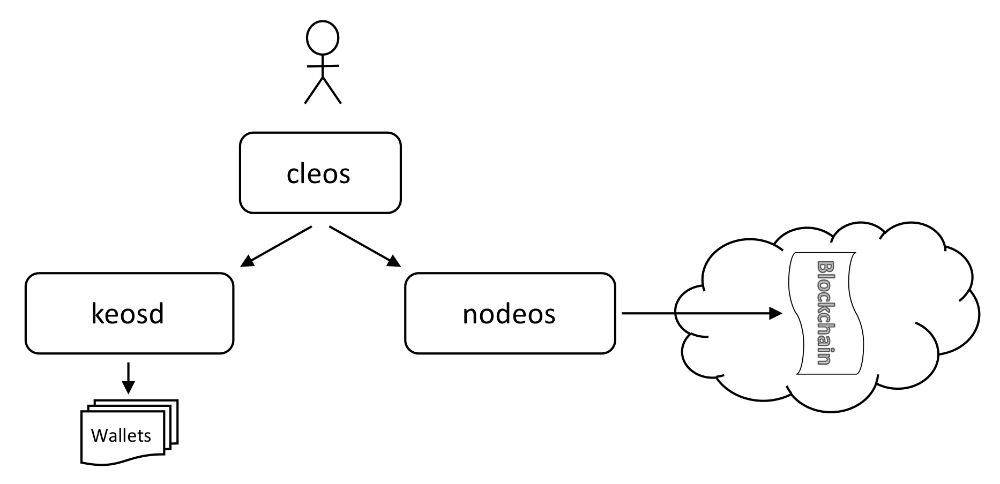

<!-- TOC -->

- [개요](#개요)
- [코드 받기](#코드-받기)
- [EOSIO 빌드하기](#eosio-빌드하기)
    - [자동화된 빌드 스크립트](#자동화된-빌드-스크립트)
    - [시스템 요구사항(모든 플랫폼 공통)](#시스템-요구사항모든-플랫폼-공통)
    - [빌드 스크립트 실행](#빌드-스크립트-실행)
    - [빌드 검증](#빌드-검증)
    - [실행 파일 인스톨하기](#실행-파일-인스톨하기)
- [단일 노드 테스트넷 생성하고 실행하기](#단일-노드-테스트넷-생성하고-실행하기)
- [EOSIO를 수동으로 빌드하기](#eosio를-수동으로-빌드하기)
    - [수동 빌드](#수동-빌드)
- [종속관계 프로그램의 수동 설치](#종속관계-프로그램의-수동-설치)
    - [Amazon 2017.09 이후에서 한번에 설치하기](#amazon-201709-이후에서-한번에-설치하기)
    - [CentOS 7 이후 버전에서 한번에 설치하기(옮긴이: 설치 과정은 모두 위와 동일한 얘기라 생략)](#centos-7-이후-버전에서-한번에-설치하기옮긴이-설치-과정은-모두-위와-동일한-얘기라-생략)
    - [Clean install Fedora 25 and higher](#clean-install-fedora-25-and-higher)
    - [Clean install Ubuntu 16.04 & Linux Mint 18](#clean-install-ubuntu-1604--linux-mint-18)
    - [Clean install MacOS Sierra 10.12.6 & higher](#clean-install-macos-sierra-10126--higher)
- [도커(Docker)](#도커docker)
    - [종속관계 프로그램](#종속관계-프로그램)
    - [EOSIO 이미지 빌드](#eosio-이미지-빌드)
    - [nodeos 도커 컨테이너만으로 시작하기](#nodeos-도커-컨테이너만으로-시작하기)
    - [체인 정보 보기](#체인-정보-보기)
    - [nodeos와 keosd 컨테이너로 시작하기](#nodeos와-keosd-컨테이너로-시작하기)
        - [cleos 명령어 실행](#cleos-명령어-실행)
        - [기본 설정 변경](#기본-설정-변경)
        - [데이터 디렉토리 삭제](#데이터-디렉토리-삭제)
- [문제해결 가이드](#문제해결-가이드)

<!-- /TOC -->
## 개요

EOSIO는 여러 프로그램으로 구성돼 있습니다. 가장 주로 사용될 프로그램들이자, 여기서 다룰 프로그램들은 다음과 같습니다:

* `nodeos` - 서버 사이드 블록체인 노드 컴포넌트
* `cleos` - 블록체인과 상호작용하고 지갑을 관리하기 위한 커맨드 라인 인터페이스
* `keosd` - EOSIO 지갑을 관리하는 컴포넌트

이 컴포넌트 사이의 기본적인 관계는 다음 다이어그램에 표시된바와 같습니다. 다음 섹션부터는, EOSIO 컴포넌트를 빌드하고 단일 호스트에 배포하여 단일 노드 테스트 네트워크(testnet)를 구성하는 방법을 알아보겠습니다.


## 코드 받기

모든 코드를 다운로드받으려면, `eos` 소스 저장소와 하위모듈을 클론하세요.

```bash
git clone https://github.com/EOSIO/eos --recursive
```

혹시 `--recursive` 플래그를 안쓰고 클론했다면, 하위모듈을 다음 명렁어로 다시 받을 수 있습니다:

```bash
git submodule update --init --recursive
```

EOSIO 문서와 튜토리얼 전체에서 작업은 여러분이 내려받은 EOSIO 소스 저장소의 최상위 폴더에서 진행됩니다. 위치는 `eos` 저장소를 클론한 바로 그 위치입니다. \${EOSIO_SOURCE}로 그 위치를 표현하도록 하겠습니다. 예를 들자면, `git clone` 작업을 `~/myprojects` 폴더에서 수행했다면, `${EOSIO_SOURCE}=~/myprojects/eos`가 됩니다. _**${EOSIO_SOURCE} 는 문서에서 표현 목적으로만 사용한다는 점을 명심하세요. 어떤 환경 변수도 정의하거나 필요하지 않습니다.**_ 편의상 보다 일반적으로 그냥 `eos`로 표현하는 경우도 있습니다. 이 역시 `${EOSIO_SOURCE}`와 동일합니다.

## EOSIO 빌드하기
EOSIO를 빌드하는 간단한 방법은 자동화된 빌드 스크립트를 사용하는 것입니다. 아래에서 자동화된 접근법을 설명하겠습니다. 수동으로 EOSIO를 빌드하는 방법은 이 문서의 훨씬 더 아래에 있는 [EOSIO를 수동으로 빌드하기](#eosio를-수동으로-빌드하기) 섹션에서 설명하도록 하겠습니다.

빌드가 완료되면 결과는 `eos/build` 폴더에 생성됩니다. 실행파일들은 그 하위폴더인 `eos/build/programs` 폴더에서 확인할 수 있습니다.

### 자동화된 빌드 스크립트

모든 종속관계 프로그램(dependencies)을 인스톨하고 EOSIO를 빌드하는 자동화된 빌드 스크립트에 대해 설명하겠습니다. 이 스크립트는 다음 운영체제를 지원합니다. 향후에는 더 많은 Linux/Unix 호환 운영체제를 지원하도록 작업중입니다.

1. Amazon 2017.09 and higher.  
2. Centos 7.  
3. Fedora 25 and higher (Fedora 27 recommended).  
4. Mint 18.  
5. Ubuntu 16.04 (Ubuntu 16.10 recommended).  
6. MacOS Darwin 10.12 and higher (MacOS 10.13.x recommended).  

### 시스템 요구사항(모든 플랫폼 공통)
- 8GB RAM
- 20GB Disk

### 빌드 스크립트 실행
빌드 스크립트를 `eos` 폴더에서 실행시키세요.

```bash
cd eos
./eosio_build.sh
```

### 빌드 검증

몇 가지 기본 검증을 수행해 빌드가 잘 됐는지 판단할 수 있게 하는 테스트 몇 가지를 사용할 수 있습니다. 빌드가 완료된 뒤 테스트를 돌리려면 `mongod`를 실행한 뒤 `make test`를 실행하면 됩니다.

Linux 플랫폼에서:
```bash
~/opt/mongodb/bin/mongod -f ~/opt/mongodb/mongod.conf &
```

MacOS에서:
```bash
/usr/local/bin/mongod -f /usr/local/etc/mongod.conf &
```

이후에 플랫폼 공통으로 다음 명령을 수행합니다:
```bash
cd build
make test
```

### 실행 파일 인스톨하기

컨트랙트 개발의 편의를 위해 컨텐츠들은 `make install` 을 이용해 `usr/local` 폴더에 인스톨할 수 있습니다. 이 단계는 `build` 폴더에서 수행돼야 합니다. 인스톨을 위해서는 적법한 권한이 필요하기 때문에, `sudo` 명령어로 `make install`을 실행시킵니다.

```bash
cd build
sudo make install
```

## 단일 노드 테스트넷 생성하고 실행하기

프로젝트를 성공적으로 빌드했다면, `nodeos` 바이너리가 `build/programs/nodeos` 폴더에 존재하게 됩니다. `nodeos` 는 `build` 폴더에서 `programs/nodeos/nodeos` 명령어로 실행하거나 `cd programs/nodeos` 명령어로 폴더를 이동한 다음에 `nodeos` 명령어를 실행해도 됩니다. 여기서는 `programs/nodeos` 폴더로 이동해서 작업을 진행하도록 하겠습니다.

단일 노드 블록체인을 이 명령어만으로 시작할 수 있습니다:

```
cd programs/nodeos
./nodeos -e -p eosio --plugin eosio::wallet_api_plugin --plugin eosio::chain_api_plugin --plugin eosio::account_history_api_plugin 
```

`nodeos`를 실행시키면 아래와 유사한 로그 메시지를 보실 수 있게 됩니다. 블록이 성공적으로 생산되고 있다는 뜻입니다.

```
1575001ms thread-0   chain_controller.cpp:235      _push_block          ] initm #1 @2017-09-04T04:26:15  | 0 trx, 0 pending, exectime_ms=0
1575001ms thread-0   producer_plugin.cpp:207       block_production_loo ] initm generated block #1 @ 2017-09-04T04:26:15 with 0 trxs  0 pending
1578001ms thread-0   chain_controller.cpp:235      _push_block          ] initc #2 @2017-09-04T04:26:18  | 0 trx, 0 pending, exectime_ms=0
1578001ms thread-0   producer_plugin.cpp:207       block_production_loo ] initc generated block #2 @ 2017-09-04T04:26:18 with 0 trxs  0 pending
...
eosio generated block 046b9984... #101527 @ 2018-04-01T14:24:58.000 with 0 trxs
eosio generated block 5e527ee2... #101528 @ 2018-04-01T14:24:58.500 with 0 trxs
...
```

이 시점에서 `nodeos`는 `eosio`라는 단일 프로듀서를 실행하고 있습니다.

방금 생성한 단일 호스트 테스트넷을 그려보면 아래 그림과 같이 됩니다. 궁금하실까봐 언급하지만 이 설정에서 우리는 `nodeos`를 지갑 관리를 위해서도 사용하고 있습니다. `nodeos` 명령어줄에 지정돼 있는 `eosio::wallet_api_plugin`은 지갑을 관리하는 `eosio::wallet_plugin`과 의존관계이기 때문에, 자동으로 적재시켜 줍니다. 다른 선택지들은 [상세한 계정 및 지갑 튜토리얼](https://github.com/EOSIO/eos/wiki/Tutorial-Comprehensive-Accounts-and-Wallets)에서 설명하도록 하겠습니다. 어떤 설정을 사용하건 간에, `cloes`는 지갑을 관리하고, 계정을 관리하며, 블록체인에 액션을 전달하기 위해 사용됩니다.


> ### 심화 단계
> 숙련된 사용자라면 설정을 수정해 보고 싶을 것입니다. `nodeos`는 커스텀 설정 폴더를 사용하고 있습니다. 이 폴저의 위치는 시스템에 따라 다릅니다.
> 
> - Mac OS: `~/Library/Application Support/eosio/nodeos/config`
> - Linux: `~/.local/share/eosio/nodeos/config`
> 
> 빌드하면 이 폴더에 기본 `genesis.json` 파일을 생성합니다. 설정 폴더는 `nodeos`의 실행인자 중 `--config-dir`로 지정할 수 있습니다. 이 옵션을 사용할 경우, `genesis.json` 파일을 지정한 설정 폴더에 수동으로 카피해야 합니다.
> 
> `nodeos`가 제 역할을 하려면 제대로 설정된 `config.ini` 파일이 필요합니다. 시작 시 `nodeos`는 설정 폴더에서 `config.ini` 파일을 찾고,  발견되지 않는다면 `config.ini` 파일을 생성합니다. 제대로 설정된 `config.ini` 파일이 없이 처음 시작할 때는 우선 `nodeos` 를 실행하고  <kbd>Ctrl-C</kbd>로 바로 종료시킵니다. 기본 설정(`config.ini`) 파일이 설정 폴더에 생성돼 있을 것입니다.
> 이 파일을 편집해서 기본 설정된 세팅들을 추가/변경하세요.
> 
> ```
>    # Load the testnet genesis state, which creates some initial block producers with the default key
>    genesis-json = /path/to/eos/source/genesis.json
>    # Enable production on a stale chain, since a single-node test chain is pretty much always stale
>    enable-stale-production = true
>    # Enable block production with the testnet producers
>    producer-name = eosio
>    # Load the block producer plugin, so you can produce blocks
>    plugin = eosio::producer_plugin
>    # Wallet plugin
>    plugin = eosio::wallet_api_plugin
>    # As well as API and HTTP plugins
>    plugin = eosio::chain_api_plugin
>    plugin = eosio::http_plugin
>    # This will be used by the validation step below, to view account history
>    plugin = eosio::account_history_api_plugin
> ```
> 
> 이제 `nodeos`를 실행시켜서 블록을 생산하는지 확인하세요.
> ```bash
> programs/nodeos/nodeos
> ```
> 
> `nodeos`는 런타임 데이터(e.g. 공유 메모리나 로그 내용)를 지정된 데이터 폴더에 저장합니다. 이 폴더의 위치는 시스템에 따라 다릅니다.
> 
> - Mac OS: `~/Library/Application Support/eosio/nodeos/data`
> - Linux: `~/.local/share/eosio/nodeos/data`
> 
> 데이터 폴더는 `nodeos` 명령어의 실행인자 중 `--data-dir`를 이용해 지정할 수 있습니다.


## EOSIO를 수동으로 빌드하기
### 수동 빌드

수동 빌드를 하려면, 다음 단계를 거쳐 `build` 폴더를 `eos` 폴더 안에 생성하면 됩니다. 아래의 단계에서는 `eos` 저장소가 홈(`~`) 폴더 아래에 클론됐다고 가정하고 작업을 진행할 것입니다. 또한, 필요한 종속관계 프로그램들도 인스톨돼 있다고 가정하겠습니다. [종속관계 프로그램의 수동 설치](#manualdep) 항목을 참고하세요.

```bash
cd ~
mkdir -p ~/eos/build && cd ~/eos/build
```

Linux 플랫폼에서는 다음과 같이 `cmake` 명령어를 사용하세요:
``` bash
cmake -DBINARYEN_BIN=~/binaryen/bin -DWASM_ROOT=~/wasm-compiler/llvm -DOPENSSL_ROOT_DIR=/usr/local/opt/openssl -DOPENSSL_LIBRARIES=/usr/local/opt/openssl/lib -DBUILD_MONGO_DB_PLUGIN=true ..
```

MacOS에서는, 다음과 같이 `cmake` 명령어를 사용하세요:
``` bash
cmake -DBINARYEN_BIN=~/binaryen/bin -DWASM_ROOT=/usr/local/wasm -DOPENSSL_ROOT_DIR=/usr/local/opt/openssl -DOPENSSL_LIBRARIES=/usr/local/opt/openssl/lib -DBUILD_MONGO_DB_PLUGIN=true ..
```

이후 플랫폼 공통으로 다음 과정을 수행합니다:
``` bash
make -j$( nproc )
```

Out-of-source 빌드 역시 지원됩니다. clang의 기본 컴파일러 설정을 덮어쓰려면 cmake 명령어를 사용할 때 다음 플래그를 설정하세요:

`-DCMAKE_CXX_COMPILER=/path/to/c++ -DCMAKE_C_COMPILER=/path/to/cc`

디버그 빌드를 하려면 `-DCMAKE_BUILD_TYPE=Debug` 인자를 추가하면 됩니다. 이외에도 `Release`와 `RelWithDebInfo`가 사용됩니다.

<a name="manualdep"></a>
## 종속관계 프로그램의 수동 설치

종속관계에 있는 프로그램들을 수동으로 빌드하고자 한다면, 다음 단계대로 하면 됩니다.

이 프로젝트는 주로 C++14로 작성돼 있으며 빌드 시스템으로는 CMake를 사용하고 있습니다. Clang의 최신 버전과, CMake의 최신 버전을 사용하길 추천합니다.

종속관계 프로그램 목록:

* Clang 4.0.0
* CMake 3.5.1
* Boost 1.66
* OpenSSL
* LLVM 4.0
* [secp256k1-zkp (Cryptonomex branch)](https://github.com/cryptonomex/secp256k1-zkp.git)

### Amazon 2017.09 이후에서 한번에 설치하기

다음 개발 툴킷을 설치합니다:

```bash
sudo yum update
sudo yum install git gcc72.x86_64 gcc72-c++.x86_64 autoconf automake libtool make bzip2 \
				 bzip2-devel.x86_64 openssl-devel.x86_64 gmp.x86_64 gmp-devel.x86_64 \
				 libstdc++72.x86_64 python36-devel.x86_64 libedit-devel.x86_64 \
				 ncurses-devel.x86_64 swig.x86_64 gettext-devel.x86_64

```

CMake 3.10.2를 설치합니다:

```bash
cd ~
curl -L -O https://cmake.org/files/v3.10/cmake-3.10.2.tar.gz
tar xf cmake-3.10.2.tar.gz
rm -f cmake-3.10.2.tar.gz
ln -s cmake-3.10.2/ cmake
cd cmake
./bootstrap
make
sudo make install
```

Boost 1.66을 설치합니다:

```bash
cd ~
curl -L https://dl.bintray.com/boostorg/release/1.66.0/source/boost_1_66_0.tar.bz2 > boost_1.66.0.tar.bz2
tar xf boost_1.66.0.tar.bz2
echo "export BOOST_ROOT=$HOME/boost_1_66_0" >> ~/.bash_profile
source ~/.bash_profile
cd boost_1_66_0/
./bootstrap.sh "--prefix=$BOOST_ROOT"
./b2 install
```
[MongoDB (mongodb.org)](https://www.mongodb.com)를 설치합니다:

```bash
mkdir ${HOME}/opt
cd ${HOME}/opt
curl -OL https://fastdl.mongodb.org/linux/mongodb-linux-x86_64-amazon-3.6.3.tgz
tar xf mongodb-linux-x86_64-amazon-3.6.3.tgz
rm -f mongodb-linux-x86_64-amazon-3.6.3.tgz
ln -s ${HOME}/opt/mongodb-linux-x86_64-amazon-3.6.3/ ${HOME}/opt/mongodb
mkdir ${HOME}/opt/mongodb/data
mkdir ${HOME}/opt/mongodb/log
touch ${HOME}/opt/mongodb/log/mongod.log
		
tee > /dev/null ${HOME}/opt/mongodb/mongod.conf <<mongodconf
systemLog:
 destination: file
 path: ${HOME}/opt/mongodb/log/mongod.log
 logAppend: true
 logRotate: reopen
net:
 bindIp: 127.0.0.1,::1
 ipv6: true
storage:
 dbPath: ${HOME}/opt/mongodb/data
mongodconf

export PATH=${HOME}/opt/mongodb/bin:$PATH
mongod -f ${HOME}/opt/mongodb/mongod.conf
```
[mongo-cxx-driver (release/stable)](https://github.com/mongodb/mongo-cxx-driver)를 설치합니다:

```bash
cd ~
curl -LO https://github.com/mongodb/mongo-c-driver/releases/download/1.9.3/mongo-c-driver-1.9.3.tar.gz
tar xf mongo-c-driver-1.9.3.tar.gz
cd mongo-c-driver-1.9.3
./configure --enable-static --enable-ssl=openssl --disable-automatic-init-and-cleanup --prefix=/usr/local
make -j$( nproc )
sudo make install
git clone https://github.com/mongodb/mongo-cxx-driver.git --branch releases/stable --depth 1
cd mongo-cxx-driver/build
cmake -DBUILD_SHARED_LIBS=OFF -DCMAKE_BUILD_TYPE=Release -DCMAKE_INSTALL_PREFIX=/usr/local ..
sudo make -j$( nproc )
```

[secp256k1-zkp (Cryptonomex branch)](https://github.com/cryptonomex/secp256k1-zkp.git)를 설치합니다:

```bash
cd ~
git clone https://github.com/cryptonomex/secp256k1-zkp.git
cd secp256k1-zkp
./autogen.sh
./configure
make -j$( nproc )
sudo make install
```

기본적으로 LLVM과 clang은 빌드 결과물 중에 WASM이 포함돼 있지 않기 때문에 직접 빌드해 줘야 합니다:

```bash
mkdir  ~/wasm-compiler
cd ~/wasm-compiler
git clone --depth 1 --single-branch --branch release_40 https://github.com/llvm-mirror/llvm.git
cd llvm/tools
git clone --depth 1 --single-branch --branch release_40 https://github.com/llvm-mirror/clang.git
cd ..
mkdir build
cd build
cmake -G "Unix Makefiles" -DCMAKE_INSTALL_PREFIX=.. -DLLVM_TARGETS_TO_BUILD= -DLLVM_EXPERIMENTAL_TARGETS_TO_BUILD=WebAssembly -DCMAKE_BUILD_TYPE=Release ../
make -j$( nproc ) 
make install
```

환경이 다 설정됐습니다. 이제 [EOS를 빌드하고 노드를 올릴 수 있습니다](#eosio-빌드하기).
(옮긴이: 원문이 HTML 문서를 markdown으로 바꾸고 업데이트하면서 링크가 깨진 것으로 보이기 때문에 임의로 #eosio-빌드하기로 링크했습니다.)

### CentOS 7 이후 버전에서 한번에 설치하기(옮긴이: 설치 과정은 모두 위와 동일한 얘기라 생략)

Install the development toolkit:
* Installation on Centos requires installing/enabling the Centos Software Collections
  Repository.
  [Centos SCL](https://wiki.centos.org/AdditionalResources/Repositories/SCL):

```bash
sudo yum --enablerepo=extras install centos-release-scl
sudo yum update
sudo yum install -y devtoolset-7
scl enable devtoolset-7 bash
sudo yum install -y python33.x86_64
scl enable python33 bash
sudo yum install git autoconf automake libtool make bzip2 \
				 bzip2-devel.x86_64 openssl-devel.x86_64 gmp-devel.x86_64 \
				 ocaml.x86_64 doxygen libicu-devel.x86_64 python-devel.x86_64 \
				 gettext-devel.x86_64

```

Install CMake 3.10.2:

```bash
cd ~
curl -L -O https://cmake.org/files/v3.10/cmake-3.10.2.tar.gz
tar xf cmake-3.10.2.tar.gz
cd cmake-3.10.2
./bootstrap
make -j$( nproc )
sudo make install
```

Install Boost 1.66:

```bash
cd ~
curl -L https://dl.bintray.com/boostorg/release/1.66.0/source/boost_1_66_0.tar.bz2 > boost_1.66.0.tar.bz2
tar xf boost_1.66.0.tar.bz2
echo "export BOOST_ROOT=$HOME/boost_1_66_0" >> ~/.bash_profile
source ~/.bash_profile
cd boost_1_66_0/
./bootstrap.sh "--prefix=$BOOST_ROOT"
./b2 install
```

Install [MongoDB (mongodb.org)](https://www.mongodb.com):

```bash
mkdir ${HOME}/opt
cd ${HOME}/opt
curl -OL https://fastdl.mongodb.org/linux/mongodb-linux-x86_64-amazon-3.6.3.tgz
tar xf mongodb-linux-x86_64-amazon-3.6.3.tgz
rm -f mongodb-linux-x86_64-amazon-3.6.3.tgz
ln -s ${HOME}/opt/mongodb-linux-x86_64-amazon-3.6.3/ ${HOME}/opt/mongodb
mkdir ${HOME}/opt/mongodb/data
mkdir ${HOME}/opt/mongodb/log
touch ${HOME}/opt/mongodb/log/mongod.log
		
tee > /dev/null ${HOME}/opt/mongodb/mongod.conf <<mongodconf
systemLog:
 destination: file
 path: ${HOME}/opt/mongodb/log/mongod.log
 logAppend: true
 logRotate: reopen
net:
 bindIp: 127.0.0.1,::1
 ipv6: true
storage:
 dbPath: ${HOME}/opt/mongodb/data
mongodconf

export PATH=${HOME}/opt/mongodb/bin:$PATH
mongod -f ${HOME}/opt/mongodb/mongod.conf
```

Install [mongo-cxx-driver (release/stable)](https://github.com/mongodb/mongo-cxx-driver):

```bash
cd ~
curl -LO https://github.com/mongodb/mongo-c-driver/releases/download/1.9.3/mongo-c-driver-1.9.3.tar.gz
tar xf mongo-c-driver-1.9.3.tar.gz
cd mongo-c-driver-1.9.3
./configure --enable-static --enable-ssl=openssl --disable-automatic-init-and-cleanup --prefix=/usr/local
make -j$( nproc )
sudo make install
git clone https://github.com/mongodb/mongo-cxx-driver.git --branch releases/stable --depth 1
cd mongo-cxx-driver/build
cmake -DBUILD_SHARED_LIBS=OFF -DCMAKE_BUILD_TYPE=Release -DCMAKE_INSTALL_PREFIX=/usr/local ..
sudo make -j$( nproc )
```

Install [secp256k1-zkp (Cryptonomex branch)](https://github.com/cryptonomex/secp256k1-zkp.git):

```bash
cd ~
git clone https://github.com/cryptonomex/secp256k1-zkp.git
cd secp256k1-zkp
./autogen.sh
./configure
make -j$( nproc )
sudo make install
```

By default LLVM and clang do not include the WASM build target, so you will have to build it yourself:

```bash
mkdir  ~/wasm-compiler
cd ~/wasm-compiler
git clone --depth 1 --single-branch --branch release_40 https://github.com/llvm-mirror/llvm.git
cd llvm/tools
git clone --depth 1 --single-branch --branch release_40 https://github.com/llvm-mirror/clang.git
cd ..
mkdir build
cd build
cmake -G "Unix Makefiles" -DCMAKE_INSTALL_PREFIX=.. -DLLVM_TARGETS_TO_BUILD= -DLLVM_EXPERIMENTAL_TARGETS_TO_BUILD=WebAssembly 
-DLLVM_ENABLE_RTTI=1 -DCMAKE_BUILD_TYPE=Release ../
make -j$( nproc ) 
make install
```

Your environment is set up. Now you can <a href="#runanode">build EOS and run a node</a>.

### Clean install Fedora 25 and higher

Install the development toolkit:

```bash
sudo yum update
sudo yum install git gcc.x86_64 gcc-c++.x86_64 autoconf automake libtool make cmake.x86_64 \
				 bzip2-devel.x86_64 openssl-devel.x86_64 gmp-devel.x86_64 \
				 libstdc++-devel.x86_64 python3-devel.x86_64 libedit.x86_64 \
				 mongodb.x86_64 mongodb-server.x86_64 ncurses-devel.x86_64 \
				 swig.x86_64 gettext-devel.x86_64

```

Install Boost 1.66:

```bash
cd ~
curl -L https://dl.bintray.com/boostorg/release/1.66.0/source/boost_1_66_0.tar.bz2 > boost_1.66.0.tar.bz2
tar xf boost_1.66.0.tar.bz2
echo "export BOOST_ROOT=$HOME/boost_1_66_0" >> ~/.bash_profile
source ~/.bash_profile
cd boost_1_66_0/
./bootstrap.sh "--prefix=$BOOST_ROOT"
./b2 install
```
Install [mongo-cxx-driver (release/stable)](https://github.com/mongodb/mongo-cxx-driver):

```bash
cd ~
curl -LO https://github.com/mongodb/mongo-c-driver/releases/download/1.9.3/mongo-c-driver-1.9.3.tar.gz
tar xf mongo-c-driver-1.9.3.tar.gz
cd mongo-c-driver-1.9.3
./configure --enable-static --enable-ssl=openssl --disable-automatic-init-and-cleanup --prefix=/usr/local
make -j$( nproc )
sudo make install
git clone https://github.com/mongodb/mongo-cxx-driver.git --branch releases/stable --depth 1
cd mongo-cxx-driver/build
cmake -DBUILD_SHARED_LIBS=OFF -DCMAKE_BUILD_TYPE=Release -DCMAKE_INSTALL_PREFIX=/usr/local ..
sudo make -j$( nproc )
```

Install [secp256k1-zkp (Cryptonomex branch)](https://github.com/cryptonomex/secp256k1-zkp.git):

```bash
cd ~
git clone https://github.com/cryptonomex/secp256k1-zkp.git
cd secp256k1-zkp
./autogen.sh
./configure
make -j$( nproc )
sudo make install
```

By default LLVM and clang do not include the WASM build target, so you will have to build it yourself:

```bash
mkdir  ~/wasm-compiler
cd ~/wasm-compiler
git clone --depth 1 --single-branch --branch release_40 https://github.com/llvm-mirror/llvm.git
cd llvm/tools
git clone --depth 1 --single-branch --branch release_40 https://github.com/llvm-mirror/clang.git
cd ..
mkdir build
cd build
cmake -G "Unix Makefiles" -DCMAKE_INSTALL_PREFIX=.. -DLLVM_TARGETS_TO_BUILD= -DLLVM_EXPERIMENTAL_TARGETS_TO_BUILD=WebAssembly -DCMAKE_BUILD_TYPE=Release ../
make -j$( nproc ) install
```

Your environment is set up. Now you can <a href="#runanode">build EOS and run a node</a>.

### Clean install Ubuntu 16.04 & Linux Mint 18

Install the development toolkit:

```bash
sudo apt-get update
wget -O - https://apt.llvm.org/llvm-snapshot.gpg.key|sudo apt-key add -
sudo apt-get install clang-4.0 lldb-4.0 libclang-4.0-dev cmake make \
                     libbz2-dev libssl-dev libgmp3-dev \
                     autotools-dev build-essential \
                     libbz2-dev libicu-dev python-dev \
                     autoconf libtool git mongodb
```

Install Boost 1.66:

```bash
cd ~
wget -c 'https://sourceforge.net/projects/boost/files/boost/1.66.0/boost_1_66_0.tar.bz2/download' -O boost_1.66.0.tar.bz2
tar xjf boost_1.66.0.tar.bz2
cd boost_1_66_0/
echo "export BOOST_ROOT=$HOME/boost_1_66_0" >> ~/.bash_profile
source ~/.bash_profile
./bootstrap.sh "--prefix=$BOOST_ROOT"
./b2 install
source ~/.bash_profile
```

Install [mongo-cxx-driver (release/stable)](https://github.com/mongodb/mongo-cxx-driver):

```bash
cd ~
curl -LO https://github.com/mongodb/mongo-c-driver/releases/download/1.9.3/mongo-c-driver-1.9.3.tar.gz
tar xf mongo-c-driver-1.9.3.tar.gz
cd mongo-c-driver-1.9.3
./configure --enable-static --enable-ssl=openssl --disable-automatic-init-and-cleanup --prefix=/usr/local
make -j$( nproc )
sudo make install
git clone https://github.com/mongodb/mongo-cxx-driver.git --branch releases/stable --depth 1
cd mongo-cxx-driver/build
cmake -DBUILD_SHARED_LIBS=OFF -DCMAKE_BUILD_TYPE=Release -DCMAKE_INSTALL_PREFIX=/usr/local ..
sudo make -j$( nproc )
```

Install [secp256k1-zkp (Cryptonomex branch)](https://github.com/cryptonomex/secp256k1-zkp.git):

```bash
cd ~
git clone https://github.com/cryptonomex/secp256k1-zkp.git
cd secp256k1-zkp
./autogen.sh
./configure
make
sudo make install
```

By default LLVM and clang do not include the WASM build target, so you will have to build it yourself:

```bash
mkdir  ~/wasm-compiler
cd ~/wasm-compiler
git clone --depth 1 --single-branch --branch release_40 https://github.com/llvm-mirror/llvm.git
cd llvm/tools
git clone --depth 1 --single-branch --branch release_40 https://github.com/llvm-mirror/clang.git
cd ..
mkdir build
cd build
cmake -G "Unix Makefiles" -DCMAKE_INSTALL_PREFIX=.. -DLLVM_TARGETS_TO_BUILD= -DLLVM_EXPERIMENTAL_TARGETS_TO_BUILD=WebAssembly -DCMAKE_BUILD_TYPE=Release ../
make -j4 install
```

Your environment is set up. Now you can <a href="#runanode">build EOS and run a node</a>.

### Clean install MacOS Sierra 10.12.6 & higher

macOS additional Dependencies:

* Brew
* Newest XCode
* MongoDB C++ driver

Upgrade your XCode to the newest version:

```bash
xcode-select --install
```

Install homebrew:

```bash
ruby -e "$(curl -fsSL https://raw.githubusercontent.com/Homebrew/install/master/install)"
```

Install the dependencies:

```bash
brew update
brew install git automake libtool cmake boost openssl@1.0 llvm@4 gmp ninja gettext mongodb
brew link gettext --force
```
Install [mongo-cxx-driver (release/stable)](https://github.com/mongodb/mongo-cxx-driver):

```bash
cd ~
brew install --force pkgconfig
brew unlink pkgconfig && brew link --force pkgconfig
curl -LO https://github.com/mongodb/mongo-c-driver/releases/download/1.9.3/mongo-c-driver-1.9.3.tar.gz
tar xf mongo-c-driver-1.9.3.tar.gz
rm -f mongo-c-driver-1.9.3.tar.gz
cd mongo-c-driver-1.9.3
./configure --enable-static --enable-ssl=darwin --disable-automatic-init-and-cleanup --prefix=/usr/local
make -j$( sysctl -in machdep.cpu.core_count )
sudo make install
cd ..
rm -rf mongo-c-driver-1.9.3

git clone https://github.com/mongodb/mongo-cxx-driver.git --branch releases/stable --depth 1
cd mongo-cxx-driver/build
cmake -DBUILD_SHARED_LIBS=OFF -DCMAKE_BUILD_TYPE=Release -DCMAKE_INSTALL_PREFIX=/usr/local ..
make -j$( sysctl -in machdep.cpu.core_count )
sudo make install
cd ..
rm -rf mongo-cxx-driver
```

Install [secp256k1-zkp (Cryptonomex branch)](https://github.com/cryptonomex/secp256k1-zkp.git):

```bash
cd ~
git clone https://github.com/cryptonomex/secp256k1-zkp.git
cd secp256k1-zkp
./autogen.sh
./configure
make -j$( sysctl -in machdep.cpu.core_count )
sudo make install
```

Build LLVM and clang for WASM:

```bash
mkdir  ~/wasm-compiler
cd ~/wasm-compiler
git clone --depth 1 --single-branch --branch release_40 https://github.com/llvm-mirror/llvm.git
cd llvm/tools
git clone --depth 1 --single-branch --branch release_40 https://github.com/llvm-mirror/clang.git
cd ..
mkdir build
cd build
cmake -G "Unix Makefiles" -DCMAKE_INSTALL_PREFIX=.. -DLLVM_TARGETS_TO_BUILD= -DLLVM_EXPERIMENTAL_TARGETS_TO_BUILD=WebAssembly -DCMAKE_BUILD_TYPE=Release ../
make -j$( sysctl -in machdep.cpu.core_count )
make install
```

Your environment is set up. Now you can <a href="#runanode">build EOS and run a node</a>.


<a name="3-docker"></a>
## 도커(Docker)

EOS를 도커에 올려 간단하고 빠르게 설정할 수도 있습니다. EOSIO 도커에 대한 최신 정보를 [Docker Readme](https://github.com/EOSIO/eos/blob/master/Docker/README.md)에서 확인할 수 있습니다.
                                                                   

### 종속관계 프로그램
 - [도커](https://docs.docker.com) 도커 17.05 이후 버전이 필요합니다.

### EOSIO 이미지 빌드

```bash
$ git clone https://github.com/EOSIO/eos.git --recursive
$ cd eos/Docker
$ docker build . -t eosio/eos
```

### nodeos 도커 컨테이너만으로 시작하기

```bash
$ docker run --name nodeos -p 8888:8888 -p 9876:9876 -t eosio/eos start_nodeos.sh arg1 arg2
```

기본적으로는, 모든 데이터가 도커 볼륨 내에 보존됩니다. 데이터가 오래됐거나 오염됐다면 지울 수 있습니다:
``` bash
$ docker inspect --format '{{ range .Mounts }}{{ .Name }} {{ end }}' nodeos
fdc265730a4f697346fa8b078c176e315b959e79365fc9cbd11f090ea0cb5cbc
$ docker volume rm fdc265730a4f697346fa8b078c176e315b959e79365fc9cbd11f090ea0cb5cbc
```

또한 직접 호스트를 컨테이너에 마운트하는 것도 선택 가능합니다.
```bash
$ docker run --name nodeos -v /path-to-data-dir:/opt/eos/bin/data-dir -p 8888:8888 -p 9876:9876 -t eosio/eos start_nodeos.sh arg1 arg2
```

### 체인 정보 보기

```bash
$ curl http://127.0.0.1:8888/v1/chain/get_info
```

### nodeos와 keosd 컨테이너로 시작하기

```bash
$ docker-compose up
```

`docker-compose up` 명령어를 실행한 이후, nodeos와 keosd라는 두 서비스가 시작됩니다. nodeos 서비스는 8888 번 포트와 9876 포트를 엽니다. keosd 서비스는 포트를 열지 않고, cleos를 keosd 컨테이너 안에서 실행시켰을 경우 cleos로만 접근할 수 있습니다. 이 과정은 "cleos 명령어 실행" 섹션에서 설명하겠습니다.


#### cleos 명령어 실행

bash에서 alias 를 이용해서 `cleos` 명령어를 실행할 수 있습니다.

```bash
$ alias cleos='docker-compose exec keosd /opt/eos/bin/cleos -H nodeos'
$ cleos get info
$ cleos get account inita
```

간단한 거래소 컨트랙트를 업로드해 보겠습니다.

```bash
$ cleos set contract exchange contracts/exchange/exchange.wast contracts/exchange/exchange.abi
```

앞으로 keosd를 사용하지 않을 것이라면 다음 명령어로 keosd 서비스를 종료할 수 있습니다:

```bash
$ docker-compose stop keosd
```

#### 기본 설정 변경

기본 설정을 변경하기 위해서는 도커의 compose(docker-compose) 기능 중 파일 덮어쓰기(override)를 이용하면 됩니다. 예를 들면, 변경한 설정 파일 `config2.ini`을 만들고 `docker-compose.override.yml` 파일에 다음 항목을 추가하는 것입니다.

```yaml
version: "2"

services:
  nodeos:
    volumes:
      - nodeos-data-volume:/opt/eos/bin/data-dir
      - ./config2.ini:/opt/eos/bin/data-dir/config.ini
```

이제 도커 컨테이너를 다음과 같이 재시작하세요:

```bash
$ docker-compose down
$ docker-compose up
```

#### 데이터 디렉토리 삭제
docker-compose로 만든 데이터 영역은 다음과 같이 하면 삭제할 수 있습니다:

```bash
$ docker volume rm docker_nodeos-data-volume
```

<a name="5-troubleshooting-guide"></a>
## 문제해결 가이드

1. *`nodeos`를 실행했을 때 `St9exception: content of memory does not match data expected by executable`라는 에러가 발생합니다*
> `nodeos`를 `--resync` 실행인자를 주고 재시작해보세요
2. 현재 실행중이거나 연결하려는 `nodeos`의 버전을 어떻게 알 수 있나요?
> `cleos -H ${nodeos_host} -p ${nodeos_port} get info` 명령어를 실행하고 결과에 `server_version` 필드를 보시면 버전을 알 수 있습니다

## 번역 정보

* 위키 원문 : https://github.com/eosio/eos/wiki/Local-Environment
* 번역 기준 리비전 : 7b2fdd1f342892620b7eab54c35cd1d07488bb01
