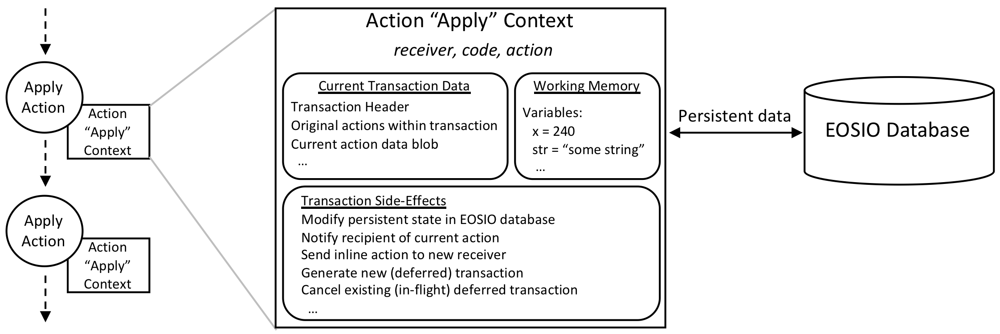
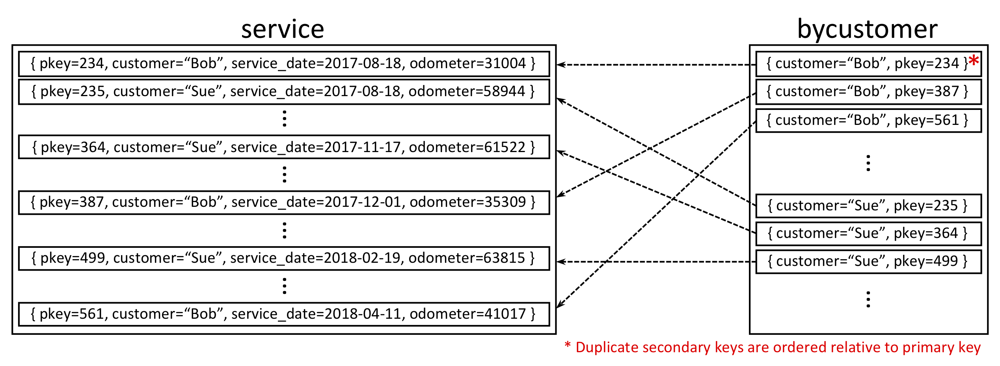
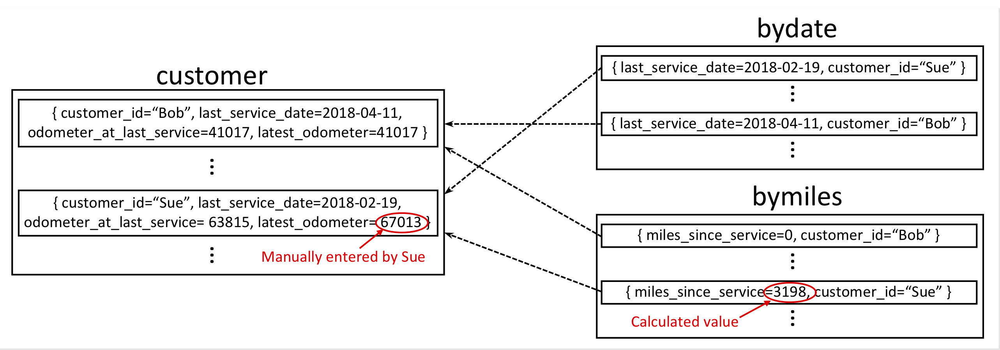

EOSIO 블록체인 상에서 보존되는 데이터를 멀티 인덱스 컨테이너로 추상화

- [저장 API](#저장-api)
    - [개요](#개요)
        - [저장 서비스의 필요성](#저장-서비스의-필요성)
    - [EOSIO 멀티 인덱스 API](#eosio-멀티-인덱스-api)
        - [EOSIO 멀티 인덱스 반복자](#eosio-멀티-인덱스-반복자)
    - [모아서 보기](#모아서-보기)
        - [EOSIO 멀티 인덱스 테이블을 생성하는 방법](#eosio-멀티-인덱스-테이블을-생성하는-방법)
        - [EOSIO 멀티 인덱스 테이블을 사용하는 방법](#eosio-멀티-인덱스-테이블을-사용하는-방법)
    - [차량 유지보수 이력 추적 예제](#차량-유지보수-이력-추적-예제)
- [C++ API Reference](#c-api-reference)
    - [eosio::multi_index](#eosiomulti_index)
    - [indexed_by](#indexed_by)
    - [eosio::multi_index::index API(2차 인덱스)](#eosiomulti_indexindex-api2차-인덱스)

# 저장 API

## 개요

EOSIO는 컨트랙트 개발자가 액션 간, 결과적으로는 트랜잭션 간의 경계를 넘어서 상태를 보존(persist)할 수 있도록 하는 일련의 서비스와 인터페이스를 제공합니다. 보존성이 유지되지 않는다면, 액션과 트랜잭션을 처리하는 과정에서 생성되는 상태들은 처리가 끝난 이후 소멸될 수 있습니다. 보존을 위한 컴포넌트에는 다음이 포함됩니다:

1. DB에 상태를 저장하는 서비스
2. DB 내용을 검색하고 가져오는 발전된 쿼리 기능
3. 위의 서비스를 컨트랙트 개발자가 사용할 수 있도록 제공되는 C++ API
4. 라이브러리와 시스템 개발자를 위해 제공될 핵심 서비스 접근을 위한 C API

이 문서에서는 1~3번 주제를 다루도록 하겠습니다.

### 저장 서비스의 필요성

액션은 EOSIO 컨트랙트에서 실질적인 작업을 수행합니다. 액션은 액션 컨텍스트로 불리는 환경 내에서 동작됩니다. 아래의 다이어그램에서 보실 수 있듯, 액션 컨텍스트는 액션의 실행을 위해 필요한 일련의 내용을 제공합니다. 이들 중 하나는 액션의 작업 메모리입니다. 액션은 이 메모리 내에 작업중인 상태를 저장합니다. EOSIO는 액션을 위해 깨끗하게 비워진 작업 메모리를 제공합니다. 다른 액션이 실행됐을 때 설정된 변수는 새 액션의 컨텍스트 내에서는 사용할 수 없습니다. 액션 간에 상태를 전달하는 유일한 방법은, EOSIO DB에 상태를 보존하고 이것을 받아오는 것 뿐입니다.



## EOSIO 멀티 인덱스 API

EOSIO 멀티 인덱스 API는 EOSIO DB에 대한 C++ 인터페이스를 제공합니다. EOSIO 멀티 인덱스 API는 [boost 멀티 인덱스 컨테이너](https://www.boost.org/doc/libs/1_66_0/libs/multi_index/doc/index.html)를 따와서 만들었습니다. 이 API는 다양한 검색 기능을 가진 객체 저장 공간에 대한 모델을 제공하기 때문에, 멀티 인덱스를 사용해서 다양한 정렬이나 검색 기법을 사용할 수 있습니다. 멀티 인덱스 API는 [`EOSIO/eos` GitHub 저장소](https://github.com/EOSIO/eos/)의 `contracts/eosiolib` 폴더 내에 존재하는 [`eosio::multi_index`](https://github.com/EOSIO/eos/blob/master/contracts/eosiolib/multi_index.hpp)  C++ 클래스 형태로 제공됩니다. 이 클래스는 C++로 개발된 컨트랙트가 EOSIO DB에 보존된 상태를 읽고 수정할 수 있도록 합니다.

멀티 인덱스 컨테이너 인터페이스인 `eosio::multi_index`는 임의의 C++ 타입(꼭 예전의 낡은 데이터 타입이거나 고정 크기 타입이 아니어도 됩니다)과 동형(homogenous)의 컨테이너를 제공합니다. 이 컨테이너는 (객체를) 객체로부터 파생된 다양한 타입들을 키로 삼은 멀티 인덱스로 정렬하여 저장합니다. 이것은 행, 열, 인덱스를 가진 전통적 DB 테이블에 비교될 수 있습니다. 또한 [Boost 멀티 인덱스 컨테이너](https://www.boost.org/doc/libs/1_66_0/libs/multi_index/doc/index.html)와도 쉽게 비교할 수 있습니다.

개념적으로 `eosio::multi_index`는 상용 DB의 테이블로 볼 수 있습니다. 컨테이너 내의 개별 객체가 (테이블의) 한 행에 해당하고, 컨테이너 내 객체의 멤버 속성이 열에 해당하며, 객체 멤버 속성과 호환되는 키는 객체를 빠르게 검색하도록 하는 인덱스인 셈입니다.

종래의 DB 테이블은 인덱스를 테이블의 몇 열에 대한 사용자 정의 함수로 구현할 수 있습니다. `eosio::multi_index` 역시 유사하게 인덱스가 사용자 정의 함수(요소 타입의 `class`/`struct` 내 멤버 함수로 제공되는)로 구현될 수 있습니다. 단, 리턴 값은 지원되는 키 타입의 제한된 집합 중 하나로 제한됩니다.

종래의 DB 테이블은 대개 하나의 고유한 기본 키(primary key)를 가지고 있어서 명확하게 테이블 내의 특정 행을 식별할 수 있으며, 테이블의 행에 대한 표준 정렬 순서를 제공합니다. `eosio::multi_index` 역시 유사한 구조를 가지고 있습니다만, `eosio::multi_index` 컨테이너 내 객체의 기본 키는 반드시 고유한 부호 없는 64 비트 정수(unsigned 64-bit integer)여야 합니다. `eosio::multi_index` 컨테이너 내 객체는 기본 키 인덱스(부호 없는 64 비트 정수)의 오름차순으로 정렬돼 있습니다.


### EOSIO 멀티 인덱스 반복자

다른 블록체인 시스템에 비해 EOSIO 저장 서비스의 가장 주요한 차이점은 멀티 인덱스 반복자입니다. 키-값 쌍만을 저장하는 다른 블록체인과 달리 EOSIO 멀티 인덱스 테이블은 컨트랙트 개발자가 객체 내에 존재하는 데이터에서 파생되는 다양한 종류의 키로 정렬해 객체들을 저장할 수 있도록 합니다. 이로 인해 풍부한 검색 기능을 갖추게 됐습니다. 최대 16개 까지 2차 인덱스를 정의할 수 있으며, 테이블의 내용은 이들을 이용해 정렬되고 검색됩니다.

EOSIO 멀티 인덱스 반복자는 일반적인 C++ 반복자와 같은 패턴을 따릅니다. 모든 반복자는 양방향 `const`이며, 즉 `const_iterator` 이거나 `const_reverse_iterator` 입니다. 반복자는 멀티 인덱스 테이블 내의 객체를 접근하기 위해 참조 해제될(dereferenced) 수 있습니다.


## 모아서 보기

### EOSIO 멀티 인덱스 테이블을 생성하는 방법

EOSIO 멀티 인덱스 테이블을 이용해 데이터를 저장하는 전 단계를 종합해 보겠습니다.

- C++ `class`나 `struct`를 이용해 객체를 정의합니다. 객체 별로 각각의 멀티 인덱스 테이블에 저장될 것입니다.
- 객체 생성 `class`나 `struct` 내에 `uint_64_t` 타입 기본 키를 리턴하는 `primary_key` `const` 멤버 함수를 정의합니다.
- 2차 인덱스를 결정합니다. 최대 16개 까지 인덱스가 지원되며, 두 번째 인덱스는 아래와 같이 몇 종류의 키 타입을 지원합니다:
    - `idx64` - 내장 64-bit 부호 없는 정수 키
    - `idx128` - 내장 128-bit 부호 없는 정수 키
    - `idx256` - 256-bit 고정 크기 사전 편성(lexicographical) 키
    - `idx_double` - 배정도 부동소수점 키
    - `idx_long_double` - 4 배정도 부동소수점 키
- 각 2차 인덱스마다 키 추출 함수를 정의합니다. 키 추출 함수는 멀티 인덱스 테이블 내의 엘리먼트에서 키를 추출하기 위해 사용되는 함수입니다. 아래의 [멀티 인덱스 생성자](#생성)와 [indexed_by](#indexed_by) 섹션을 참고하세요.

### EOSIO 멀티 인덱스 테이블을 사용하는 방법

- 멀티 인덱스 테이블을 인스턴스화합니다.
- 컨트랙트에서 필요한 객체를 테이블에 삽입(`emplace`) 하고 이후에 `modify`하거나 `erase` 합니다.
- 반복자와 `get`, `find`를 이용해 객체를 가져오거나 찾습니다.


## 차량 유지보수 이력 추적 예제

아래의 예제에서는, EOSIO 멀티 인덱스 API를 이용해 간단한 차량 유지보수 이력 추적기를 구현해 보도록 하겠습니다.
추적기는 차량의 유지보수 이력 원장을 저장합니다.

추적기의 목표 사용자는 정비사와 고객입니다. 정비사는 작업을 마치고 나서 원장에 기록을 추가합니다. 그들은 이 정보를 이용해 서비스 이력을 추적하고, 고객에게 다음 정비 시점이 다가올 경우 알려줄 수 있습니다. 고객은 자신들이 받은 정비 이력을 추적해 볼 수 있습니다.

또한, 정기적으로 자동차의 주행 거리를 업데이트해서 정비사들이 언제 정비가 필요한 시점일지 더 잘 결정할 수 있게 할 수 있습니다.

만약 이 예제의 전체 컨트랙트를 구현한다면, 다음과 같은 액션이 필요합니다:

- 새 서비스 기록을 생성. 이 기능은 정비사가 사용합니다
- 주행 거리 업데이트. 이 기능은 정비사(정비하는 차)와 고객(자신의 차량) 모두 사용할 수 있습니다
- 여러 가지 종류의 보고 액션

이 예제의 목적을 위해서 저장과 검색 기능에만 초점을 맞추도록 하겠습니다.

실제로 이 애플리케이션에서는 두 테이블이 필요합니다. 첫 테이블은 정비사가 생성하는 개별 서비스 트랜잭션을 저장합니다. 고객이 자동차를 정비받을 때 마다 이 테이블 내에 레코드가 생성되기 떄문에 한 고객은 여러 레코드를 가질 수 있습니다. 두 번째 테이블은 고객의 현재 상태를 저장합니다. 각 고객은 이 테이블에 하나의 레코드만을 가집니다. 문제를 간단하게 하기 위해, 이 예제에서는 고객 당 차가 한대라고 제한하겠습니다.

### 차량 정비 이력 추적기 `service` 테이블

각각의 서비스를 저장하는 테이블을 `service` 테이블이라고 합시다. 이 테이블은 정비 서비스 기록 보고를 생성하기 위해 사용될 것입니다. 이 테이블의 레코드는 다음 속성을 가집니다:
- 기본 키 - 한 고객이 여러 레코드를 가질 수 있기 때문에 고객 ID는 기본 키가 될 수 없습니다. 사실, 직접적인 기본 키는 필요 없습니다. 따라서 시스템이 알아서 생성하도록 합시다.
- 고객 ID - 고객의 계정명(`uint64_t` 값)입니다.
- 정비 일자 - 정비를 받은 날짜입니다.
- 주행 거리계 - 차량이 서비스를 받은 날의 주행 거리계 수치입니다.

이 테이블은 고객 단위 검색이 필요할 수 있기 때문에 고객 속성에 2차 인덱스를 생성하겠습니다. 아래의 다이어그램이 `service` 테이블과 2차 인덱스인 `bycustomer`의 관계를 보여줍니다.



위에서 설명한 속성을 가진 `service_rec` 구조체를 선언해서 서비스 레코드 객체를 표현합시다:

```
struct service_rec {
    uint64_t        pkey;           // opaque, will use available_primary_key()
    account_name    customer;       // will create a secondary index on this
    uint32_t        service_date;
    uint32_t        odometer;
    
    auto            primary_key()const { return pkey; }
    account_name    get_customer()const { return customer; }

    EOSLIB_SERIALIZE( service_rec, (pkey)(customer)(service_date)(odometer) )
};
```

`service` 테이블을 인스턴스화하기 위해(이 인스턴스의 이름은 `service_table`로 붙입시다), 컨트랙트에 다음 코드를 써 줍니다, 여기서 `mechanic`은 정비사의 계정명입니다.

```
using service_table_type = multi_index<service, service_rec,
    indexed_by< N(bycustomer), const_mem_fun<service_rec, account_name, &service_rec::get_customer> >
>;
service_table_type service_table( current_receiver(), mechanic );
```

생성자에 전달되는 두 패러미터는 테이블의 접근 권한을 생성합니다. 첫 패러미터(`code` 패러미터로, 자세한 내용은 [아래](#생성)를 참조하세요)는 액션이 자신의 컨트랙트가 저장하고 있는 상태에 접근하고 있는 지(즉, `code == current_receiver()`, 이 때는 액션 컨텍스트 내에서 테이블의 읽기 및 쓰기를 수행할 수 있습니다), 아니면 다른 컨트랙트가 저장하고 있는 상태에 접근하고 있는 지(이 때는 당연히 읽기 전용) 결정하는 역할을 합니다.

`service_table`에 레코드를 추가하기 위해, 아래와 유사한(서비스 레코드 항목에 대해 지역변수가 있다고 가정합시다) C++ 코드를 작성할 수 있습니다. 변수 `customer_name`에는 인간이 읽을 수 있는 문자로 된 고객의 이름이 들어 있으며, 이것을 테이블에 저장된 고객의 `account_name`으로 변환해야 합니다.

```
service_table.emplace(mechanic, [&]( auto& s_rec ) {
    s_rec.pkey = service_table.available_primary_key();
    s_rec.customer = eosio::chain::string_to_name(customer_name);
    s_rec.service_date = service_date;
    s_rec.odometer = odometer;
});
```
고객의 모든 정비 기록을 찾기 위해 우선 `bycustomer` 2차 인덱스를 얻어옵시다.
```
auto customer_index = service_table.template get_index<N(bycustomer)>();
```
이제 이 2차 인덱스를 이용해 `find`로 원하는 고객을 찾습니다.
```
account_name customer_acct = eosio::chain::string_to_name(customer_name);
auto cust_itr = customer_index.find(customer_acct);
```

2차 인덱스의 반복자를 순회하여 고객의 모든 `service` 레코드를 가져올 수 있습니다.
```
while (cust_itr != service_table.end() && cust_itr->customer == customer_acct) {
    // code to process customer record...
    ...
    cust_itr++;
} 
```

### 차량 정비 트래커 `customer` 테이블
두 번째 테이블에는 고객의 현재 상태가 저장됩니다. 이 테이블을 `customer` 라고 하겠습니다. 이 상태는 다음 속성을 가집니다:

- 고객 ID - `customer` 테이블 내에서 이 값은 고유해야 합니다. 따라서 이 값을 기본 키 _(위에서도 밝혔다시피 문제를 간단하게 하기 위해 고객 당 차량이 한대라고 제한하겠습니다)_ 로 사용하겠습니다.
- 최종 정비일 - 차량의 마지막 정기 정비일입니다.
- 최종 정비일의 주행 거리계 - 차량이 마지막으로 정비받은 시점의 주행 거리계 수치입니다.
- 최종 정비 이후 주행거리 - 고객이나 정비사가 최신 주행 거리계 값을 업데이트할 때 계산됩니다(고객이 자발적으로 하거나 정비사가 정비를 수행할 때 마다)

최종 정비일과 최종 정비 이후 주행거리를 `customer` 테이블의 인덱스로 삼겠습니다. 아래의 다이어그램에서 `customer` 테이블과 2차 인덱스인 `bydate`, `bymiles` 간 관계를 보실 수 있습니다. 이 예제에서 Sue는 직접 자신의 최신 주행 거리계 값을 애플리케이션이 제공하는 인터페이스를 이용해 입력했습니다. 따라서 최종 정비 이후 주행거리가 계산되며 이 값을 인덱스화 해야 합니다. 이 인덱스들을 이용해 정비사는 날짜와 운행 거리(적어도 직접 거리를 업데이트한)를 기준으로  고객의 차량 정비가 필요한 시점인지를 판별할 수 있습니다. 이 값들을 사용하는 예제가 아래에 나와 있습니다.



이들 속성을 가진 `customer_rec` 구조체를 선언해서 서비스 레코드 객체를 표현합시다:
```
struct customer_rec {
    account_name    customer_id             // primary key
    uint64_t        last_service_date;      // will create a secondary index on this
    unit32_t        odometer_at_last_service;
    uint32_t        latest_odometer;
    
    auto            primary_key()const { return customer_id; }
    uint64_t        get_last_service_date()const { return last_service_date; }
    uint64_t        get_miles_since_service()const {
                        return latest_odometer > odometer_at-last_service ? latest_odometer - odometer_at_last_service : 0;
                    }

    EOSLIB_SERIALIZE( customer_rec, (customer_id)(last_service_date)(odometer_at_last_service)(latest_odometer) )
};
```
`customer` 테이블을 인스턴스화(`customer_table`이라고 부르겠습니다)하기 위해, 컨트랙트 내에 다음의 코드를 써 줍니다. 여기서 `mechanic`은 정비사의 계정명입니다.
```
using customer_table_type = multi_index<customer, customer_rec,
   indexed_by< N(bydate), const_mem_fun<customer_rec, uint64_t, &customer_rec::get_last_service_date> >,
   indexed_by< N(bymiles), const_mem_fun<customer_rec, uint64_t, &customer_rec::get_miles_since_service> >
>;
customer_table_type customer_table( current_receiver(), mechanic );
```
`customer_table`에 레코드를 추가하기 위해 다음과 같이(고객 레코드 항목에 대해 지역변수가 있다고 가정합시다) 다음과 유사한 C++코드를 사용할 수 있습니다. 변수 `customer_name`에는 인간이 읽을 수 있는 문자로 된 고객의 이름이 들어 있으며, 이것을 테이블에 저장된 고객의 `account_name`으로 변환해야 합니다.

```
customer_table.emplace(mechanic, [&]( auto& c_rec ) {
    c_rec.customer_id = eosio::chain::string_to_name(customer_name);
    c_rec.last_service_date = current_date;
    c_rec.odometer_at_last_service = current_odometer;
    c_rec.latest_odometer = current_odometer;
});
```
이제 기본 키 `customer_id`를 이용해 `find`로 고객을 찾을 수 있습니다.
```
account_name customer_id = eosio::chain::string_to_name(customer_name);
auto cust_itr = customer_table.find(customer_id);
```
`latest_odometer`를 업데이트하기 위해 다음과 비슷하게 해 봅시다.
```
account_name customer_id = eosio::chain::string_to_name(customer_name);
customer_table.modify(customer_table.get(customer_id), mechanic, [&]( auto& c_rec) {
    c_rec.latest_odometer = customer_provided_odometer_reading;     // customer provided input
});
```
`mechanic` 패러미터가 업데이트 액션의 비용을 지불하는 계정입니다. 이 예제에서는 정비사나 고객이 `latest_odometer` 속성을 업데이트할 수 있지만, 자발적으로 주행 거리를 업데이트하는 고객에게 비용을 지불하라고 할 수는 없기 때문입니다.

위에서 보시다시피 `miles_since_service` 속성을 업데이트하려면 계산이 필요합니다. 예제에서는 `customer_odometer_at_last_service` 변수가 고객이 최종적으로 정비받은 시점의 주행 거리계 값을 자장하고 있습니다. `service` 테이블에서 `bycustomer` 2차 인덱스를 이용해 고객의 최근 정비 기록을 검색할 수 있습니다. 이 인덱스를 사용하는 방법은 위의 `service` 테이블 예제를 참고하세요.

`customer_table`의 2차 인덱스를 가져오려면 다음과 같이 하면 될 것입니다:
```
auto last_service_date_index = customer_table.template get_index<N(bydate)>();
auto miles_since_service_index = customer_table.template get_index<N(bymiles)>();
```
`bydate` 2차 인덱스를 사용한 반복자를 역순회해서 정비 시점이 다가온 모든 고객을 얻어올 수 있습니다. 예를 들자면 최종 정비 시점이 3개월 이상 지났다거나 말이죠.
```
auto overdue_date_itr = last_service_date_index.upper_bound(three_months_ago);  // date for three months earlier than today
// code to iterate the customer table backwards from three months ago
...
```
`bymiles` 2차 인덱스를 사용한 반복자를 순회해서 정비 시점이 다가온 모든 고객을 얻어올 수 있습니다. 예를 들자면 최종 정비 시점 이후 주행 거리가 3000 마일 이상이라거나요. 
```
auto over_miles_itr = last_service_date_index.lower_bound(3000);  // all records 3000 or more miles
// code to iterate the customer table forward for greater than 3000 miles
...
```

# C++ API Reference

## eosio::multi_index

이 섹션에서는 `eosio::multi_index` C++ API를 문서화했습니다. 이 인터페이스는 Boost의 멀티 인덱스 컨테이너 라이브러리를 개조했으며, 키 추출을 위해 `boost/multi_index/const_mem_fun` 클래스 템플릿을 직접 사용했습니다. [www.boost.org](https://www.boost.org)에 있는 Boost의 문서에서 보다 자세한 정보나 개념을 확인하실 수 있습니다.

아래 설명에서는 공통 템플릿 선언을 위해 아래의 별명(alias)을 사용할 것입니다.

(옮긴이: API 자체 테이블은 번역하지 않았습니다.)

Alias | Description
----- | -----
_object_type_ | The type of an object in the Multi-Index table
_secondary_index_ | The type of the appropriate Secondary Index of the Multi-Index table

## 생성

Method | Description
----- | -----
`multi_index( uint64_t code, uint64_t scope )` | Constructs an instance of a Multi-Index table
_**Parameters**_ | 
`code` | account that owns table
`scope` | scope identifier within the `code` hierarchy
_**Postcondition**_ | A new empty instance of a Multi-Index table is created
 | `code` and `scope` member properties are initialized
 | each secondary index table initialized

_**주의:**_ `eosio::multi_index` 템플릿은 템플릿 패러미터로 `<uint64_t TableName, typename T, typename... Indices>`을 가지며, 각각은 다음과 같은 의미입니다:
 - `TableName`은 테이블의 이름으로, 최대 12자 길이이며, 소문자, 1~5 사이 숫자, "."(마침표) 문자로 구성돼 있습니다;
 - `T`는 객체 타입입니다(즉, 행 정의);
 - `Indices`는 최대 16개까지의 2차 인덱스 리스트입니다.
    - 각각은 생성 가능한 `class`나 `struct`여야 합니다.
    - 각각은 테이블 객체 타입의 const 참조형을 인자로 받아서 2차 키 타입이나 2차 키 타입의 참조형을 리턴하는 함수 호출 연산자가 있어야 합니다.
    - `boost::multi_index::const_mem_fun`으로 정의돼 있는 `eosio::const_mem_fun` 템플릿을 사용할 것을 권장합니다. 상세한 내용은 Boost의 `const_mem_fun` 키 추출 함수를 참고하세요.

## 복사, 대입

복사 생성자와 대입 연산자는 지원되지 않습니다.

## 테이블 제어

### emplace

Method | Description
----- | -----
`const_iterator emplace( unit64_t payer, Lambda&& constructor )` | Adds a new object (i.e., row) to the table.
_**Parameters**_ | 
`payer` | account name of the payer for the Storage usage of the new object
`constructor` | lambda function that does an in-place initialization of the object to be created in the table
_**Returns**_ | a primary key Iterator to the newly created object
_**Precondition**_ | 
 | `payer` is a valid account that authorized the current action (and thus allowed to be billed for storage usage)
_**Postcondition**_ | 
 | A new object is created in the Multi-Index table, with a unique primary key (as specified in the object).  The object is serialized and written to the table. If the table does not exist, it is created.
 | Secondary indices are updated to refer to the newly added object. If the secondary index tables do not exist, they are created.
 | The payer is charged for the storage usage of the new object and, if the table (and secondary index tables) must be created, for the overhead of the table creation.
_**Exceptions**_ | The current receiver is not the account that owns the table (the `code` of `multi_index`).

### get

Method | Description
----- | -----
`const object_type& get( uint64_t primary )const` | Retrieves an existing object from a table using its primary key.
_**Parameters**_ | 
`primary` | primary key value of the object
_**Returns**_ | A constant reference to the object containing the specified primary key.
_**Precondition**_ | None
_**Postcondition**_ | None
_**Exceptions**_ | No object matches the given key

### find

Method | Description
----- | -----
`const_iterator find( uint64_t primary )const` | Search for an existing object in a table using its primary key.
_**Parameters**_ | 
`primary` | primary key value of the object
_**Returns**_ | 
 | An iterator to the found object which has a primary key equal to `primary`, _**OR**_
 | The `end` iterator of the referenced table if an object with primary key `primary` is not found
_**Precondition**_ | None
_**Postcondition**_ | None
_**Exceptions**_ | None

### modify

Method | Description
----- | -----
`void modify( const_iterator itr, uint64_t payer, Lambda&& updater )` | Modifies an existing object in a table.
`void modify( const object_type &obj, uint64_t payer, Lambda&& updater )` | 
_**Parameters**_ | 
`itr` | an iterator pointing to the object to be updated
`obj` | a reference to the object to be updated
`payer` | account name of the payer for the Storage usage of the updated row; a value of `0` indicates that the payer of the modified row is the same as the existing payer.
`updater` | lambda function that updates the target object
_**Precondition**_ | 
 | `itr` points to, or `obj` is an existing object in the table.
 | `payer` is a valid account that authorized the current action (and thus allowed to be billed for storage usage)
_**Postcondition**_ | 
 | The modified object is serialized, then replaces the existing object in the table.
 | Secondary indices are updated; the primary key of the updated object is not changed.
 | The `payer` is charged for the storage usage of the updated object.
 | If `payer` is the same as the existing payer, `payer` only pays for the usage difference between existing and updated object (and is refunded if this difference is negative).
 | If `payer` is different from the existing payer, the existing payer is refunded for the storage usage of the existing object.
_**Exceptions**_ |
 | If called with an invalid precondition, execution is aborted.
 | The current receiver is not the account that owns the table (the `code` of `multi_index`).

### erase

Method | Description
----- | -----
`const_iterator erase( const_iterator itr )` | Remove an existing object from a table using its primary key.
`void erase( const object_type& obj )` | 
_**Parameters**_ | 
`itr` | an iterator pointing to the object to be removed
`obj` | a reference to the object to be removed
_**Returns**_ | For the signature with `const_iterator`, returns a pointer to the object following the removed object.
_**Precondition**_ | None
_**Postcondition**_ | 
 | The object is removed from the table and all associated storage is reclaimed.
 | Secondary indices associated with the table are updated.
 | The existing payer for storage usage of the object is refunded for the table and secondary indices usage of the removed object, and if the table and indices are removed, for the associated overhead.
_**Exceptions**_ | 
 | The object to be removed is not in the table.
 | The action is not authorized to modify the table.
 | The given iterator is invalid.

## 멤버 접근

### get_code

Method | Description
----- | -----
`uint64_t get_code() const` | Returns the `code` member property.
_**Returns**_ | account name of the Code that owns the Primary Table

### get_scope

Method | Description
----- | -----
`uint64_t get_scope() const` | Returns the `scope` member property.
_**Returns**_ | scope id of the Scope within the Code of the Current Receiver under which the desired Primary Table instance can be found

## 유틸리티

### available_primary_key

Method | Description
----- | -----
`uint64_t available_primary_key()const` | Returns an available (unused) primary key value, intended to be used in tables in which the primary keys of the table are strictly intended to be auto-incrementing, and thus will never be set to custom values by the contract.  Violating this expectation could result in the table appearing to be full due to inability to allocate an available primary key. 


## 반복자

멀티 인덱스 반복자는 일반적인 C++ 반복자 패턴을 따릅니다. 모든 반복자는 양방향 `const`이며, `const_iterator`이거나 `const_reverst_iterator` 입니다. 반복자는 멀티 인덱스 테이블 내의 객체에 접근하기 위해 참조 해제될 수 있습니다.

### begin and cbegin

Method | Description
----- | -----
`const_iterator begin()const` | Returns an iterator pointing to the `object_type` with the lowest primary key value in the Multi-Index table.
`const_iterator cbegin()const` | 

### end and cend

Method | Description
----- | -----
`const_iterator end()const` | Returns an iterator pointing to the virtual row representing just past the last row of the table (assuming one exists); cannot be dereferenced; can be advanced backward but not forward.
`const_iterator cend()const` | 

### rbegin and crbegin

Method | Description
----- | -----
`const_iterator rbegin()const` | Returns a reverse iterator pointing to the `object_type` with the highest primary key value in the Multi-Index table.
`const_iterator crbegin()const` | 

### rend and crend

Method | Description
----- | -----
`const_iterator rend()const` | Returns an iterator pointing to the virtual row representing just past the last row of the table (assuming one exists); cannot be dereferenced; can be advanced forward but not backward.
`const_iterator crend()const` | 

### lower_bound

Method | Description
----- | -----
`const_iterator lower_bound( uint64_t primary )const` | Searches for the `object_type` with the lowest primary key that is greater than or equal to a given primary key.
_**Parameters**_ | 
`primary` | Primary key that establishes the target value for the lower bound search
_**Returns**_ | 
 | an iterator pointing to the `object_type` that has the lowest primary key that is greater than or equal to `primary`, _**OR**_
 | the `end` iterator if an object could not be found, including if the table does not exist

### upper_bound

Method | Description
----- | -----
`const_iterator upper_bound( uint64_t primary )const` | Searches for the `object_type` with the lowest primary key that is greater than a given primary key.
_**Parameters**_ | 
`primary` | Primary key that establishes the target value for the upper bound search
_**Returns**_ | 
 | an iterator pointing to the `object_type` that has the lowest primary key that is greater than `primary`, _**OR**_
 | the `end` iterator if an object could not be found, including if the table does not exist

### get_index

Method | Description
----- | -----
`secondary_index get_index<IndexName>()` | Returns an appropriately typed Secondary Index.
`secondary_index get_index<IndexName>() const` | 
_**Parameters**_ | 
`IndexName` | the ID of the desired secondary index
_**Returns**_ | An index of the appropriate type, i.e., one of the following:
`idx64` | Primitive 64-bit unsigned integer key
`idx128` | Primitive 128-bit unsigned integer key
`idx256` | 256-bit fixed-size lexicographical key
`idx_double` | Double precision floating point key
`idx_long_double` | Quadruple precision floating point key

### iterator_to

Method | Description
----- | -----
`const_iterator iterator_to( const object_type& obj )const` | Returns an iterator to the given object in a Multi-Index table.
_**Parameters**_ |
`obj` | a reference to the desired object
_**Returns**_ | An iterator to the given object


### indexed_by

`indexed_by` 구조체는 멀티 인덱스 테이블의 인덱스를 인스턴스화하기 위해 사용됩니다. EOSIO에서는 16개까지의 2차 인덱스를 지정할 수 있습니다.
```
template<uint64_t IndexName, typename Extractor>
struct indexed_by {
   enum constants { index_name   = IndexName };
   typedef Extractor secondary_extractor_type;
};
```

_**패러미터**_

- `IndexName`은 인덱스의 이름입니다. 이름은 EOSIO base32 인코딩된 64비트 정수이어야 하며 반드시 EOSIO의 13문자 제한을 만족해야 합니다. 첫 12글자는 a-z 사이 소문자, 0-5 사이 숫자, 그리고 "." 문자여야 하며, 13번째 문자는 (존재할 경우) a-p 사이 소문자와 "." 문자여야 합니다.
- `Extractor`는 테이블 객체에 대한 const 참조형을 받아서 2차 키 타입이나 2차 키 타입에 대한 참조를 리턴하는 함수 호출 연산자입니다. `boost::multi_index::const_mem_fun`으로 정의돼 있는 `eosio::const_mem_fun` 템플릿을 사용할 것을 권장합니다. 상세한 내용은 Boost의 `const_mem_fun` 키 추출 함수를 참고하세요.

*예제*

      multi_index<mytable, record,
         indexed_by< N(bysecondary), const_mem_fun<record, uint128_t, &record::get_secondary> >
      > table( code, scope);

*이 예제에서 멀티 인덱스 테이블 `mytable`은 객체(행) 타입인 `record`를 가지고, `bysecondary` 2차 인덱스로 인덱싱돼 있으며, 이름은 `N` 매크로를 이용해 인코딩된 포맷으로 변환돼 있습니다. `const_mem_fun` 키 추출 함수가 `record` 객체 클래스에 지정됩니다. 키 타입은 `uint128_t` 이며, 이는 `record::get_secondary` 함수를 실행해서 얻을 수 있습니다.*


## eosio::multi_index::index API(2차 인덱스)
EOSIO 멀티 인덱스 테이블은 최대 16개의 2차 인덱스를 가집니다. 인덱스는 `get_index` 메소드를 사용해 `multi_index` 객체로부터 검색될 수 있으며, 일반적인 C++ 반복자 패턴을 사용해서 순회할 수 있습니다.

여서서 설명할 `index` API는 위에서 설명한 `multi_index`와 대부분 비슷하게 동작합니다만, 몇 가지 중요한 점에서 차이가 있습니다.

- `index`는 멀티 인덱스 테이블에 접근하는 다른 수단을 줄 의도로 도입됐습니다.
- 2차 인덱스 테이블의 내용은 기본적으로 기본 키에 매핑된 키입니다. 이 매핑은 사용자에게 투명하게 제공돼, 쉽게 확인 가능합니다.
- 일부 작업은 2차 인덱스에 적용될 수 없습니다. 특히, 2차 인덱스를 사용해 컨텐츠를 저장(`emplace`)하지는 않습니다. 객체는 2차 인덱스를 이용해 수정되거나 삭제될 수 있습니다.
- 2차 테이블을 사용해 1차 컨텐츠를 검색하는 작업은 사실상 동일하며, 주된 차이점이라고는 사용되는 키 값 정도(테이블에 존재하는지 검색하기 위해 2차 인덱스에 객체를 전달할 수 없습니다)입니다. 키 값은 지원되는 2차 인덱스 타입 중 하나여야 하며, 다음과 같습니다:
    - `idx64` - 내장 64-bit 부호 없는 정수 키
    - `idx128` - 내장 128-bit 부호 없는 정수 키
    - `idx256` - 256-bit 고정 크기 사전 편성(lexicographical) 키(수학 연산이 지원되지 않음)
    - `idx_double` - 배정도 부동소수점 키
    - `idx_long_double` - 4 배정도 부동소수점 키
- 2차 인덱스는 `code`와 `scope` 멤버 속성을 가지는데, 멀티 인덱스 테이블의 해당 속성과 동일합니다.

Alias | Description
----- | -----
_object_type_ | The typename of an object in the Multi-Index table
_secondary_index_ | An appropriately typed reference to a Secondary Index

## 생성

멀티 인덱스 테이블의 생성 과정에는 2차 인덱스의 생성이 포함돼 있습니다. `index`의 직접 생성은 지원되지 않습니다.

## 복사, 대입

복사 생성자와 대입 연산자는 지원되지 않습니다.

## 테이블 제어

### get

Method | Description
----- | -----
`const object_type& get( secondary_key_type&& secondary )const` | Retrieves an existing object from a table using its secondary key. Multiple signatures are available.
`const object_type& get( const secondary_key_type& secondary )const` | 
_**Parameters**_ | 
`secondary` | secondary key value of the object
_**Returns**_ | A constant reference to the object containing the specified secondary key.
_**Precondition**_ | None
_**Postcondition**_ | None
_**Exceptions**_ | No object matches the given key

### find

Method | Description
----- | -----
`const_iterator find( secondary_key_type&& secondary )const` | Search for an existing object in a table using a secondary key.
`const_iterator find( const secondary_key_type&& secondary )const` | 
_**Parameters**_ | 
`secondary` | secondary key value of the object
_**Returns**_ | 
 | An iterator to the found object which has a secondary key equal to `secondary`, _**OR**_
 | The `end` iterator if an object with secondary key `secondary` is not found
_**Precondition**_ | None
_**Postcondition**_ | None
_**Exceptions**_ | None

### modify

Method | Description
----- | -----
`void modify( const_iterator itr, uint64_t payer, Lambda&& updater )` | Modifies an existing object in a table.
_**Parameters**_ | 
 `itr` | an iterator pointing to the object to be updated
`payer` | account name of the payer for the Storage usage of the updated row; a value of `0` indicates that the payer of the modified row is the same as the existing payer.
`updater` | lambda function that updates the target object
_**Precondition**_ | 
 | `itr` points to an existing object in the table.
 | `payer` is a valid account that authorized the current action (and thus allowed to be billed for storage usage)
_**Postcondition**_ | 
 | The modified object is serialized, then replaces the existing object in the table.
 | Secondary indices are updated; the primary key of the updated object is not changed.
 | The `payer` is charged for the storage usage of the updated object.
 | If `payer` is the same as the existing payer, `payer` only pays for the usage difference between existing and updated object (and is refunded if this difference is negative).
 | If `payer` is different from the existing payer, the existing payer is refunded for the storage usage of the existing object.
_**Exceptions**_ |
 | If called with an invalid precondition, execution is aborted.
 | The current receiver is not the account that owns the table (the `code` of `multi_index`).

### erase

Method | Description
----- | -----
`const_iterator erase( const_iterator itr )` | Remove an existing object from a table using its secondary key.
_**Parameters**_ | 
`itr` | an iterator pointing to the object to be removed
_**Returns**_ | For the signature with `const_iterator`, returns a pointer to the object following the removed object.
_**Precondition**_ | None
_**Postcondition**_ | 
 | The object is removed from the table and all associated storage is reclaimed.
 | Secondary indices associated with the table are updated.
 | The existing payer for storage usage of the object is refunded for the table and secondary indices usage of the removed object, and if the table and indices are removed, for the associated overhead.
_**Exceptions**_ | 
 | The object to be removed is not in the table.
 | The action is not authorized to modify the table.
 | The given iterator is invalid.

## 멤버 접근

### get_code

Method | Description
----- | -----
`uint64_t get_code() const` | Returns the `code` member property.
_**Returns**_ | account name of the Code that owns the Secondary Index Table

### get_scope

Method | Description
----- | -----
`uint64_t get_scope() const` | Returns the `scope` member property.
_**Returns**_ | scope id of the Scope within the Code of the Current Receiver under which the desired Secondary Index Table instance can be found

### name

Method | Description
----- | -----
`constexpr static uint64_t name()` | Returns the `index_table_name` member constant.
_**Returns**_ | the table name of the Secondary Index

### number

Method | Description
----- | -----
`constexpr static uint64_t number()` | Returns the `index_number` member constant.
_**Returns**_ | the number of the Secondary Index

## 반복자

EOSIO 2차 인덱스 반복자는 일반적인 C++ 반복자의 패턴을 따릅니다.

### const_iterator

Method | Description
----- | -----
`struct const_iterator : public std::iterator<std::bidirectional_iterator_tag, const object_type> ` | A bi-directional iterator to objects in a Multi-Index table.
_**Parameters**_ | 
`object_type` | the typename of the object in the table

### const_reverse_iterator

Method | Description
----- | -----
`typedef std::reverse_iterator<const_iterator> const_reverse_iterator` | A reverse bi-directional iterator to objects in a Multi-Index table.

### begin and cbegin

Method | Description
----- | -----
`const_iterator begin()const` | Returns an iterator pointing to the lowest secondary key value in the secondary index table.
`const_iterator cbegin()const` | 

### end and cend

Method | Description
----- | -----
`const_iterator end()const` | Returns an iterator pointing to the virtual row representing just past the last row of the table (assuming one exists); cannot be dereferenced; can be advanced backward but not forward.
`const_iterator cend()const` | 

### rbegin and crbegin

Method | Description
----- | -----
`const_iterator rbegin()const` | Returns a reverse iterator pointing to the highest secondary key value in the secondary index table.
`const_iterator crbegin()const` | 

### rend and crend

Method | Description
----- | -----
`const_iterator rend()const` | Returns a reverse iterator pointing to the virtual row representing just before the first row of the table (assuming one exists); cannot be dereferenced; can be advanced forward but not backward.
`const_iterator crend()const` | 

### lower_bound

Method | Description
----- | -----
`const_iterator lower_bound( secondary_key_type&& secondary )const` | Searches for the `object_type` with the lowest secondary key that is greater than or equal to a given secondary key.
`const_iterator lower_bound( const secondary_key_type&& secondary )const` | 
_**Parameters**_ | 
`secondary` | Secondary key that establishes the target value for the lower bound search
_**Returns**_ |
 | an iterator pointing to the object in the secondary index that has the lowest secondary key that is greater than or equal to `secondary`, _**OR**_
 | the `end` iterator if an object could not be found, including if the table does not exist

### upper_bound

Method | Description
----- | -----
`const_iterator upper_bound( secondary_key_type&& secondary )const` | Searches for the `object_type` with the lowest secondary key that is greater than a given secondary key.
`const_iterator upper_bound( const secondary_key_type&& secondary )const` | 
_**Parameters**_ | 
`secondary` | Secondary key that establishes the target value for the upper bound search
_**Returns**_ | 
 | an iterator pointing to the object in the secondary index that has the lowest secondary key that is greater than `secondary`, _**OR**_
 | the `end` iterator if an object could not be found, including if the table does not exist

### iterator_to

Method | Description
----- | -----
`const_iterator iterator_to( const object_type& obj )const` | Returns a secondary index iterator to the given object in the Multi-Index table.
_**Parameters**_ | 
`obj` | a const reference to the desired object
_**Returns**_ | An iterator to the given object

## 유틸리티

### extract_secondary_key

Method | Description
----- | -----
`static auto extract_secondary_key(const object_type& obj)` | Returns the secondary key value for an object from a secondary index.
_**Parameters**_ | 
`obj` | a const reference to the desired object
_**Returns**_ | A key value for the given object, for that index

## 번역 정보

* 원문 : https://github.com/eosio/eos/wiki/Persistence-API
* 번역 기준 리비전 : e64b717a8d9cd299edcf54b5bd84cef6b27d9eb5
