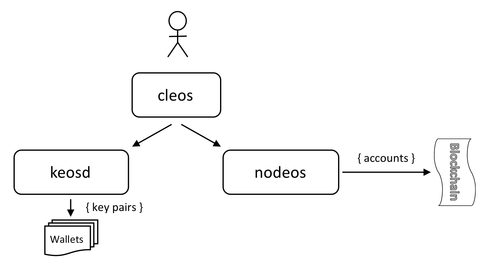

## 계정 및 지갑에 대한 전반적인 튜토리얼

**주의** _이 튜토리얼은 **사설 단일 노드 테스트넷**에서 사용하도록 작성됐습니다만, 약간의 수정을 거치면 공용 테스트넷에서도 동작합니다._

#### 튜토리얼 대상
이 튜토리얼에서는 지갑과 계정 관리에 대해 공부하고 싶은 사용자들을 위해 `cleos`를 사용해 지갑과 계정을 관리하는 방법을 포함해, 지갑과 계정을 관리하는 EOSIO 컴포넌트가 서로 어떻게 통신하는지에 대해 다룹니다. 자세한 정보는 **[명령어 레퍼런스](https://github.com/EOSIO/eos/wiki/Command-Reference)** 를 참조하세요.

#### 다룰 내용
지갑과 지갑의 키를 어떻게 생성하고 관리하는지 다룰 것이며, `cloes`를 이용해 지갑과 블록체인을 연동하는 방법을 살펴 보겠습니다. 이후에 `cleos`를 이용해 계정을 생성하는 법을 다뤄 보겠습니다. 이 튜토리얼에서는 `cleos`, `keosd`, `nodeos`간 상호작용 중 일부를 통해 블록체인에 올라가는 컨텐츠에 서명하는 과정까지 소개할 것입니다.

#### 사전 준비
- 시스템에 `cleos`와 `keosd`를 빌드해서 실행중이어야 합니다.
- 시스템에 `nodeos`를 빌드해서 _실행할 수 있게 준비_ 돼 있어야 합니다.
- 커맨드 라인 인터페이스에 대한 기본 지식이 필요합니다.

**주의:** 도커 설치에 적용할 경우 명령어를 약간 수정해야 합니다.

### EOSIO 계정과 지갑의 개념적 개요
아래의 다이어그램은 EOSIO에서 계정과 지갑의 간단한 개념도입니다. 이 밖에도 지원되는 다른 배포 구성이 있지만, 이 그림은 이 튜토리얼에서 사용할 내용에만 해당합니다.



지갑은 공개 키-개인 키 쌍의 저장소로 생각할 수 있습니다. 이들은 블록체인에서 수행되는 작업에 대한 서명을 위해 필요합니다. 지갑과 그 내용물은 `keosd`에서 관리되며, 지갑은 `cleos`를 이용해 접근할 수 있습니다.

계정은 접근 권한(즉, 보안의 기본)을 가진, 체인 상에서의 식별자라고 생각할 수 있습니다. `nodeos`는 계정 및 계정에 관련된 블록체인 상 액션의 생성을 관리합니다. `nodeos`의 계정 관리 기능은 `cleos`를 이용해서 사용할 수 있습니다.

계정과 지갑 간에는 종속관계가 없습니다. 계정은 지갑에 대한 정보를 알지 못하며, 그 역도 마찬가지입니다. 따라서 `nodeos`와 `keosd` 간에도 종속관계가 없습니다. 이 둘의 기본적 기능은 근본적으로 다릅니다. (_물론, 구별을 모호하게 하는 배포 구성이 있습니다만, 그 주제는 이 튜토리얼의 범위를 벗어납니다._)

트랜잭션에 서명할 때처럼 서명이 필요한 시점에서 접점이 생깁니다. 지갑은 잠글 수 있는 자체 내의 암호화된 저장소에 키를 저장해서 안전한 방식으로 서명을 가져오기 쉽게 합니다. `cleos`는 `keosd`의 키 검색 연산과, 이 키들을 사용해서 생성된 서명이 필요한 `nodeos`의 계정(및 기타) 블록체인 액션 간의 중개자 역할을 효과적으로 수행합니다.

### 지갑을 생성하고 관리하기
터미널을 열고 EOSID를 빌드한 디렉토리로 이동하세요. 여기서 실행하면 `nodeos`, `keosd`와 커맨드 라인 인터페이스로 통신하는 `cleos`를 보다 쉽게 사용할 수 있습니다.

```bash
$ cd /path_to_eos/build/programs/cleos
```

우선 해야 할 일은 지갑을 생성하는 것입니다; `wallet create` 명령어를 `cleos`에서 실행하세요.

```bash
$ cleos wallet create
Creating wallet: default
Save password to use in the future to unlock this wallet.
Without password imported keys will not be retrievable.
"A MASTER PASSWORD"
```

_default_ 란 이름의 지갑이 `keosd` 상에 생기게 되며, 이 지갑의 **마스터 패스워드**가 표시됩니다. 이 패스워드를 어딘가 안전한 곳에 보관해 두시길 바랍니다. 이 패스워드는 지갑 파일의 잠금을 해제(복호화)하는 데 쓰입니다.

이 지갑의 파일명은 `default.wallet`입니다. 기본적으로 `keosd`는 지갑을 `~/eosio-wallet` 폴더에 저장합니다만, 지갑 데이터 폴더 위치는 명령어를 실행할 때 `--data-dir` 실행인자를 이용해서 지정할 수 있습니다.

#### 여러 지갑과 지갑 이름을 관리하기
`cleos`를 이용해 여러 지갑을 관리할 수 있습니다. 지갑은 각각 다른 마스터 패스워드로 보호됩니다. 아래의 예제는 다른 지갑을 생성하고 `-n` 실행인자를 이용해 이름을 정해주는 방법을 보여줍니다.

```bash
$ cleos wallet create -n periwinkle
Creating wallet: periwinkle
Save password to use in the future to unlock this wallet.
Without password imported keys will not be retrievable.
"A MASTER PASSWORD"
```

이제 지갑이 정해준 이름(옮긴이: 예제에서는 periwinkle)으로 생성됐는지 확인합시다.

```bash
$ cleos wallet list
Wallets:
[
  "default *",
  "periwinkle *"
]
```

표시된 두 지갑에 각각 아스테리스크(*) 표시가 돼 있는 것을 잘 봐 두세요, 각각 잠금 해제돼 있다는 의미입니다. `create wallet` 명령어를 사용해서 만든 지갑은 기본적으로 여러분이 사용하기 쉽게 잠금이 해제돼 있습니다.

두 번째 지갑을 `wallet lock` 명령어로 잠궈보겠습니다.

```bash
$ cleos wallet lock -n periwinkle
Locked: 'periwinkle'
```

다시 `wallet list` 명령어를 실행시켜 보면, 두 번째 지갑의 아스테리스크가 사라졌음을 보실 수 있을 겁니다. 즉, 그 지갑이 현재 잠겨 있다는 뜻입니다.

```bash
$ cleos wallet list
Wallets:
[
  "default *",
  "periwinkle"
]
```

원하는 대로 이름을 정해준 지갑의 잠금을 해제할 때는 `wallet unlock` 명령어에 `-n` 인자를 준 다음에 지갑의 이름을 써 줍니다. 이어 나오는 패스워드 입력 요청에 지갑의 마스터 패스워드를 입력해 줍니다(물론 패스워드를 복붙해 줄 수 있습니다). 위로 올라가서 생성한 두 번째 지갑의 마스터 패스워드를 복사한 다음, 명령어를 실행시키고 _password_ 입력란에 붙여넣은 뒤 _엔터_ 키를 누르면 확인이 완료됩니다.

```bash
$ cleos wallet unlock -n periwinkle
```

`cleos`는 이제 지갑이 잠금 해제됐다고 알려줄 것입니다.

```bash
Unlocked: 'periwinkle'
```

_**주의:** `--password` 실행인자를 주고 다음에 마스터 패스워드를 붙여넣으면 패스워드 입력과정이 불필요합니다만, 콘솔 실행내역 보기로 여러분의 마스터 패스워드가 노출될 수 있습니다._

이제 지금까지 진행상황을 확인해 봅시다:

```bash
$ cleos wallet list
Wallets:
[
  "default *",
  "periwinkle *"
]
```

_periwinkle_ 지갑도 아스테리스크가 붙어있습니다. 즉 지금은 잠금해제됐다는 뜻입니다.

_**주의:** `default` 지갑을 지갑 관리 명령어로 관리할 때는 `-n` 인자를 사용하지 않아도 됩니다._

이제 `keosd`를 재시작킵시다. `cleos`를 디시 실행해서 다음 명령어를 입력해 봅니다.

```bash
$ cleos wallet list
Wallets:
[]
```

보시는 것처럼 지갑은 조작하기 전에 우선 열어야(open) 합니다(옮긴이: 잠금해제(unlock)와는 다릅니다). 열리지 않은 지갑은 심지어 표시조차 안됩니다. `keosd`를 종료하면 지갑은 잠기며, `keosd`를 재시작했을 때는 열린 상태가 아닙니다. 다음 명령어로 기본 지갑을 열어서 표시해 봅시다.

```bash
$ cleos wallet open
$ cleos wallet list
Wallets:
[
  "default"
]
```

_**주의:** 이름을 따로 지어준 지갑을 열고 싶다면 `$ cleos wallet open -n periwinkle` 식으로 `-n` 실행인자를 주어 실행해야 합니다._

방금 전 응답에서 기본 지갑이 초기에는 잠겨 있다는 것을 보실 수 있습니다. 이제 잠금을 해제해 봅시다; 다음 단계를 거치게 될 것입니다:

`wallet unlock` 명령어를 실행하고 _기본_ 지갑의 마스터 패스워드를 패스워드 입력란에 입력합니다.

```bash
$ cleos wallet unlock
Unlocked: 'default'
```

지갑이 잠금해제됐는지 확인합니다.

```bash
$ cleos wallet list
Wallets:
[
  "default *"
]
```

지갑(기본 지갑) 이름 뒤에 아스테리스크가 표시되고 있습니다. 즉 잠금 해제됐다는 뜻입니다.

위에서 `cleos`를 이용해 여러 지갑을 만드는 방법과 다루는 방법을 이미 살펴봤습니다만, 빈 지갑은 아무짝에도 쓸모가 없습니다. 이제 지갑에 키를 임포트해 보겠습니다.

### EOSIO 키를 생성하고 임포트하기

EOSIO 키 쌍을 생성하는 방법에는 몇 가지가 있습니다만, 이 튜토리얼에서는 `cleos`의 `create key` 명령어에 집중하겠습니다.

두 쌍의 공개/개인 키를 생성합니다. 키의 일반적인 포맷에 주목하세요.

```bash
$ cleos create key
Private key: XXXXXXXXXXXXXXXXXXXXXXXXXXXXXXXXXXXXXXXXXXXXXXXXXXX
Public key: EOSXXXXXXXXXXXXXXXXXXXXXXXXXXXXXXXXXXXXXXXXXXXXXXXXXX
$ cleos create key
Private key: XXXXXXXXXXXXXXXXXXXXXXXXXXXXXXXXXXXXXXXXXXXXXXXXXXX
Public key: EOSXXXXXXXXXXXXXXXXXXXXXXXXXXXXXXXXXXXXXXXXXXXXXXXXXX
```

이제 EOSIO 키 쌍 두 개가 생겼습니다. 이 시점에서는 단지 키 쌍만 존재할 뿐 어떠한 자격도 부여되지 않았습니다.

이전 단계를 모두 다 따라하셨다면, _default_ 지갑은 열려 있고 잠금 해제돼 있을 것입니다.

다음 단계로, 개인 키를 지갑에 임포트해 보겠습니다. `wallet import` 명령어를 두 번 실행하여 위에서 만든 *개인 키* 를 각각 임포트합니다.

```bash
$ cleos wallet import ${private_key_1}
```

두 번째 개인 키도 같은 과정을 거칩니다.

```bash
$ cleos wallet import ${private_key_2}
```

성공했다면 `wallet import` 명령어를 실행할 때 마다 그에 맞는 공개 키가 표시됩니다, 콘솔창에 반드시 다음과 유사한 결과가 나오는지 확인하세요.
(옮긴이: 결과로 나오는 공개키는 위에서 생성한 공개 키와 일치해야 합니다)

```bash
$ cleos wallet import 5Hvgh37WMCWAc4GuyRBiFrk4SArCnSQVMhNtEQVoszhBh6RgdWr
imported private key for: EOS84jJqXj5XBz3RqLreXZCMxXRKspUadXg3AVy8eb5J2axj8cywc
```

`wallet keys` 명령어를 이용해 어떤 키가 로드됐는지 확인할 수 있습니다.

```bash
$ cleos wallet keys
[[
    "EOS6....",
    "5KQwr..."
  ],
  [
    "EOS3....",
    "5Ks0e..."
  ]
]
```

지갑 파일 자체는 암호화돼 있기 때문에 잠긴 상태에서 지갑은 이 키를 보호하게 됩니다. 잠긴 지갑의 키에 접근하기 위해서는 지갑을 생성할 때 설정한 마스터 패스워드가 핋요합니다.

### 지갑을 백업하기
지갑에 키를 담아두었기 때문에, 지갑 파일의 손실에 대처하기 위해 지갑을 백업하는 습관을 들이는 것이 좋습니다. 음... 플래시 메모리나 다른 미디어가 좋겠네요. 지갑 파일은 높은 복잡도로 암호화돼 있기 때문에 지갑 안의 키는(사용할 수 있는 어떤 방법을 동원해도) 패스워드 없이는 접근할 수 없습니다.

`data-dir` 폴더에 지갑 파일이 저장돼 있습니다. eos를 실행시킬 때 `--data-dir` 실행인자로 따로 이 폴더를 변경하지 않았다면, 지갑 파일들은 `~/eosio-wallet` 폴더 내에 저장돼 있을 것입니다.

```bash
$ cd ~/eosio-wallet && ls
blockchain   blocks   config.ini   default.wallet   periwinkle.wallet
```

튜토리얼의 앞 단계를 충실히 거쳐왔다면, 두 파일이 존재할 것입니다. `default.wallet` 파일과 `periwinkle.wallet` 파일이죠. 이 파일을 안전한 위치에 저장해 둡시다.

### 계정 생성하기
블록체인에서 액션을 실행하려면 계정을 사용해야만 합니다. `cleos`를 이용해 `nodeos`에 계정을 생성하고 블록체인에 등록하는 방법을 살펴보겠습니다. 이 시점에서는 `nodeos`를 실행시켜야만 합니다. 다음 명령어는 단일 노드 테스트넷을 실행시켜줍니다. 로컬에서 단일 노드 테스트넷을 실행하는 자세한 방법은 [단일 노드 테스트넷을 생성하고 실행하기](https://github.com/eoseoul/docs/blob/master/ko/translations/Local-Environment.md#%EB%8B%A8%EC%9D%BC-%EB%85%B8%EB%93%9C-%ED%85%8C%EC%8A%A4%ED%8A%B8%EB%84%B7-%EC%83%9D%EC%84%B1%ED%95%98%EA%B3%A0-%EC%8B%A4%ED%96%89%ED%95%98%EA%B8%B0)를 참조하세요.

> 이 단계에서는 keosd와 nodeos를 동시에 실행시켜야 합니다. 현재 `keosd`와 `nodeos`는 같은 포트(8888)를 사용하고 있습니다.
> nodeos를 실행하는 작업을 간편하게 하기 위해, 이 튜토리얼에서는 `keosd`를 8899 포트에서 실행되도록 바꿔보겠습니다. 두 가지 방법이 있습니다:
> 
>  1. `keosd`의 설정 파일(`~/eosio-wallet/config.ini`)을 편집해서 http-server-address 속성을 다음과 같이 변경합니다:
>       http-server-address = 127.0.0.1:8899 
>   
>  2. 다음 실행인자를 줘서 keosd를 실행시킵니다: --http-server-address=localhost:8899
>
>  다음과 같이 실행해서 keosd를 재시작시키세요:
>     
>       $ pkill keosd
>       $ keosd --http-server-address=localhost:8899
>    
>  기본 지갑의 잠금을 해제(keosd가 재시작되면 지갑은 잠깁니다)합니다. keosd가 8899 포트를 리스닝하도록 시작됐기 때문에
>  --wallet-port 실행인자를 cleos에 주어야 합니다.
>    
>       cleos --wallet-port=8899 wallet unlock
>   
>  패스워드 입력이 필요합니다. 앞 단계에서 지갑을 생성할 때 생성된 패스워드를 입력하세요.

`nodeos`를 시작하기 위해 새 터미널 창을 엽니다. `nodeos` 실행파일이 있는 폴더로 이동한 뒤 다음과 같이 실행합니다:

```bash
$ cd eos/build/programs/nodeos
$ nodeos -e -p eosio --plugin eosio::chain_api_plugin --plugin eosio::account_history_api_plugin
```

이제 계정을 생성할 수 있습니다. `cleos create account` 명령어의 구조는 다음과 같습니다.

```bash
$ cleos create account ${authorizing_account} ${new_account} ${owner_key} ${active_key}
```

- `authorizing_account`는 계정 생성과 새 계정을 위한 비용을 지불할 계정의 이름입니다.
- `new_account`는 생성할 계정의 이름입니다.
- `owner_key`는 계정의 **소유자** 자격에 할당되는 공개 키입니다.  ([계정과 권한](https://github.com/eoseoul/docs/blob/master/ko/translations/Accounts-%26-Permissions.md)을 참조하세요)
- `active_key`는 계정의 **활동** 자격에 할당되는 공개 키입니다. 이 키를 가진 두 번째 사용자에게는 여러분 계정의 활동 자격에 대한 권한이 부여됩니다.

이 튜토리얼에서는 `eosio`가 자격을 부여하는 계정입니다. 블록체인 상에서 수행되는 액션들은 `eosio` 계정과 연관된 키를 이용해 서명돼야 합니다. `eosio` 계정은 EOSIO 노드를 부팅하기 위해 사용되는 특별한 계정입니다. 이 계정에 대한 키는 `nodeos` 설정파일에서 찾을 수 있습니다. Linux 플랫폼의 경우 `~/.local/shared/eosio/config/config.ini`내에 존재하며, MacOS의 경우 `~/Libraries/Application Support/eosio/nodeos/config/config.ini` 내에 존재합니다.

새로 생성한 계정에 이름이 필요합니다. 계정 이름은 다음 가이드라인을 따라야 합니다:

- 13 글자 미만일 것
- 다음 문자만을 포함하고 있을 것: .12345abcdefghijklmnopqrstuvwxyz 

"myaccount"라는 이름을 새 계정 이름으로 사용하도록 하겠습니다.

위에서 생성해 지갑에 임포트한 공개 키(공개 키가 `EOS`로 시작하는 문자열이라는 것을 기억하세요)를 사용할 것입니다. 키는 자격을 부여하기 전까지는 무용지물입니다. 하지만, 자격이 부여되면, 부여된 자격을 꼭 기억해야만 합니다. 소유자 키는 계정의 모든 제어권을 가지고 있습니다. 한편, 활동 키는 계정이 보유한 자금에 대한 모든 접근권한을 가지고 있습니다.

`cleos create account` 명령어로 계정을 생성해 보겠습니다:

```bash
$ cleos --wallet-port=8899 create account eosio myaccount ${public_key_1} ${public_key_2}
```

성공했다면 다음과 비슷한 결과가 출력됩니다.

```bash
executed transaction: 7f1c6b87cd6573365a7bb3c6aa12f8162c3373d57d148f63f2a2d3373ad2fd54  352 bytes  102400 cycles
#         eosio <= eosio::newaccount            {"creator":"eosio","name":"myaccount","owner":{"threshold":1,"keys":[{"key":"EOS5kkAs8HZ88m2N7iZWy4J...
```

#### 계정과 관련된 조작
계정에 대한 많은 `cleos` 명령어가 있습니다.

`cleos` 명령어 | 설명
----- | -----
`create account` | 블록체인에 새 계정을 생성합니다
`get account` | 블록체인에서 계정을 검색합니다
`get code` | 계정에 대한 코드와 ABI를 검색합니다
`get accounts` | 공개 키에 묶인 계정(들)을 검색합니다
`get servants` | 주어진 계정이 만든 하위 계정들을 검색합니다
`get transactions` | 범위 내에서 주어진 계정명에 해당하는 모든 트랜잭션을 검색합니다
`set contract` | 계정의 컨트랙트를 생성하거나 업데이트합니다
`set account` | 블록체인 계정의 상태를 설정하거나 업데이트합니다
`transfer` | EOS를 계정에서 다른 계정으로 전달합니다

## 번역 정보
* 원문 : https://github.com/EOSIO/eos/wiki/Tutorial-Comprehensive-Accounts-and-Wallets
* 번역 기준 리비전 : 0c18223ea118597c7b2476118091c4094be6af99
